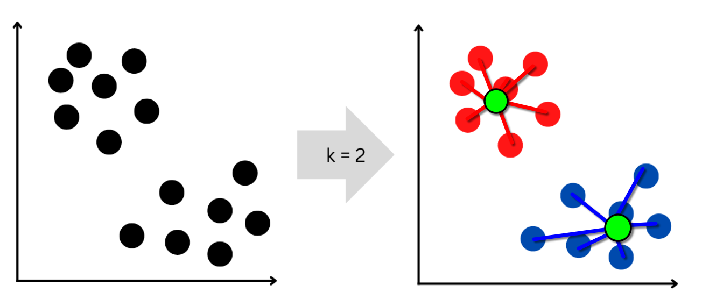

```{css, echo=FALSE}
.infobox {
  padding: 1em 1em 1em 4em;
  margin-bottom: 10px;
  border: 2px solid #4f9ed4;
  border-radius: 10px;
  background: ##a3cde5 5px center/3em no-repeat;
}

.fig_legend {
  font-size: 0.8rem;
  line-height: 1.2;
}
```

```{r include=FALSE}
#| label: load libraries
#| message: false
#| warning: false
library(tidyverse) 
library(flextable)
library(gridExtra) 
library(ggplot2) 
`%notin%` <- Negate(`%in%`)
```

# ¿Decisiones difíciles?

[HELP International](https://www.helpinternational.org/en/) es una ONG humanitaria internacional que la lucha contra la pobreza y proporciona servicios básicos y socorro a la población de los países atrasados, especialmente frente a desastres naturales.

HELP International recaudó alrededor de \$10 millones USD y quería utilizar ese dinero de forma estratégica para desarrollar campañas de ayuda en los países que más lo necesitasen.

<div>

::: {.infobox data-latex="warning"}
> 🤔 ¿Cómo decidimos qué países necesitan más ayuda?
:::

</div>

HELP International publicó una tabla de datos sociodemográficos ([descargar](https://www.kaggle.com/datasets/rohan0301/unsupervised-learning-on-country-data/data)[^1]) de 167 países candidatos con las siguientes variables:

[^1]: La tabla de datos utilizada para este análisis fue descargada de Kaggle.

-   País.
-   Mortalidad infantil: muerte de niños menores de 5 años por cada 1.000 nacidos vivos.
-   Exportaciones: exportaciones de bienes y servicios per cápita.
-   Salud: gasto total en salud per cápita.
-   Importaciones: importaciones de bienes y servicios per cápita.
-   Ingresos: ingresos netos por persona.
-   Inflación: inflación en relación al crecimiento anual del PIB total.
-   Esperanza de vida: promedio de años que viviría un niño recién nacido si los patrones actuales de mortalidad sigan siendo los mismos.
-   Tasa de fertilidad: número de hijos que nacería de cada mujer si las tasas actuales de fecundidad por edad siguen siendo las mismas.
-   Producto interno bruto: calculado como el PIB total dividido por la población total.

La Tabla 1 muestra los 15 países con el PIB más bajo, y los valores de algunas de estas variables.

```{r países con pib más bajo}
#| message: false
#| warning: false
#| echo: false
#| cache: true
DF <- read_csv("Country-data.csv")
num_DF <- DF %>%
  column_to_rownames(var = "country") %>%
  select(gdpp, health, life_expec, child_mort, total_fer, income, 
         inflation, imports, exports) #use country column as row names
 
DF %>%
  select(country, gdpp, income, health, life_expec, child_mort) %>%
  arrange(gdpp) %>%
  setNames(c(
    "País", "PIB", "Ingreso", "Gasto Salud",
    "Esp. vida", "Mort. Infantil"
  )) %>%
  head(15) %>%
  flextable() %>%
  add_header_lines("Tabla 1. Países con el PIB más bajo.") %>% 
  theme_zebra() %>%
  autofit()
```

<div>

::: {.infobox data-latex="warning"}
> 🤷🏾‍♂️ Una primera aproximación, para ayudarnos a decidir, sería usar el PIB como un criterio de selección.
:::

</div>

# Podríamos usar el PIB cómo único criterio de selección?

Cómo una primera aproximación para nuestra toma de decisión correlacionamos todas nuestras variables con el PIB.

```{r echo=FALSE}
#| cache: true
start <- 2 # 1st col
end <- 5 # last col
target <- 1 # target col

num_DF[c(start:end, target)] %>%
  explore::explore_all(target = gdpp)# name of the target

start <- 6 # 1st col
end <- 9 # last col
target <- 1 # target col

num_DF[c(start:end, target)] %>%
  explore::explore_all(target = gdpp)
```

<div>

::: {.fig_legend data-latex=""}
**Figura 1**. Correlación del PIB (gdpp) con las otras variables socioeconómicas: health, gasto en salud; life_expec, esperanza de vida; child_mort, mortalidad infantil; total_fer, tasa de fertilidad; income, ingreso por habitante; inflation, inflación; imports, importaciones; exports, exportaciones. Cada punto de la gráfica representa un país.
:::

</div>

La Figura 1 muestra que el PIB tiene diferentes grados de correlación con el resto de variables sociodemográficas, por lo que tal vez podría utilizarse como un criterio de selección, eligiendo simplemente los países con los valores de PIB más bajos.

<div>

::: {.infobox data-latex="warning"}
> 🧐 ¿Podemos hacer algo mejor que elegir en función del PIB? ¿Es posible integrar el resto de las variables en un único criterio de selección?
:::

</div>

Para comenzar a responder a estas preguntas, buscamos patrones de agrupación en los países de acuerdo a sus características.

Si correlacionamos la esperanza de vida y el gasto en salud y los graficamos junto con el PIB y el ingreso por habitante (Fig. 2) vemos que los países tienden a formar pequeñas agrupaciones.

```{r echo=FALSE}
#| cache: true
ggplot(num_DF) +
  aes(
    x = health,
    y = life_expec,
    colour = income,
    size = gdpp
  ) +
  geom_point() +
  scale_color_distiller(palette = "Oranges", direction = 1) +
  ggtitle("A. Gasto en salud y esperanza de vida") +
  theme_minimal()
```

<div>

::: {.fig_legend data-latex=""}
**Figura 2.** Correlación del gasto en salud (health) y la esperanza de vida (life_expec). Cada país está representado por un punto en la gráfica; su tamaño es directamente proporcional al PIB (gdpp) y su color se ajusta al nivel de ingresos por habitante (income).
:::

</div>

Lo mismo ocurre si correlacionamos el gasto en salud y la mortalidad infantil y los graficamos junto con el PIB y el ingreso por habitante (Fig. 3).

```{r echo=FALSE}
#| cache: true
ggplot(num_DF) +
  aes(
    x = health,
    y = child_mort,
    colour = income,
    size = gdpp
  ) +
  geom_point() +
  scale_color_distiller(palette = "Oranges", direction = 1) +
  ggtitle("B. Gasto en salud y mortalidad infantil") +
  theme_minimal()
```

<div>

::: {.fig_legend data-latex=""}
**Figura 3.** Correlación del gasto en salud (health) y la mortalidad infantil (child_mort). Cada país está representado por un punto en la gráfica; su tamaño es directamente proporcional al PIB (gdpp) y su color se ajusta al nivel de ingresos por habitante (income).
:::

</div>

<div>

::: {.infobox data-latex="warning"}
> ⛏️ ¿Podemos explotar de alguna manera estos patrones de agrupación y obtener un criterio de selección?
:::

</div>

# Análisis de agrupación por k-medias

La agrupación (clustering) es una técnica de aprendizaje automático que nos ayuda descubrir patrones y estructuras ocultas entre nuestras variables.

La técnica k-medias (k-means) agrupa conjuntos de casos similares (por ejemplo países) utilizando variables numéricas (también llamadas dimensiones). La agrupación se lleva a cabo minimizando las distancias entre *k* grupos de casos (clusters) (Fig. 4), siendo *k* el número de agrupaciones que conocemos de antemano, o que debemos llegar a estimar.



<div>

::: {.fig_legend data-latex=""}
**Figura 4**. Agrupación de casos en dos grupos (*k* = 2). Cada uno de los ejes corresponde a una variable numérica. La distancia media entre los puntos rojos y azules (líneas de colores) y el centro de cada grupo (puntos verdes) sirve como una medida para llevar a cabo la agrupación.
:::

</div>

El primer paso para llevar a cabo el análisis de agrupación por k-medias es la normalización de los datos, con el fin de que las diferencias en las escalas de medición de cada variable no generen sesgos en las relaciones entre las variables.

La Figura 5 muestra las medias y las desviaciones estándar de cada una de las variables antes (paneles superiores) y después (paneles inferiores) de la normalización.

```{r echo=FALSE}
#| message: false
#| warning: false
# Analyze means and SDs of all variables ----
# Before normalization
# mean
par(mfrow = c(2, 2)) 
map_dbl(.x = num_DF, .f = ~ mean(.)) %>% # num_DF is a numeric data frame
  as.numeric() %>%
  plot(., main = "Means", xlab = "")
# sd
map_dbl(.x = num_DF, .f = ~ sd(.)) %>%
  as.numeric() %>%
  plot(., main = "Standard deviations", xlab = "")
scaled_DF <- num_DF %>% scale() %>% as_tibble()
row.names(scaled_DF) <- row.names(num_DF)

# After normalization
map_dbl(.x = scaled_DF, .f = ~ mean(.)) %>% # num_DF is a numeric data frame
  as.numeric() %>% 
  round(1) %>% 
  plot(., xlab = "Variable number")
# sd
map_dbl(.x = scaled_DF, .f = ~ sd(.)) %>%
  as.numeric() %>%
  plot(., xlab = "Variable number")
```

<div>

::: {.fig_legend data-latex=""}
**Figura 5.** Medias y desviaciones estándar de cada variable, antes (paneles superiores) y después (paneles inferiores) de la normalización de los datos.
:::

</div>

Como no sabemos de antemano cuántos grupos hay dentro de nuestros datos, hacemos un análisis de agrupación por k-medias serializado en usando los datos normalizados. Usamos valores de *k* de 1 a 15 (siendo *k* el número de agrupaciones esperado) y graficamos la suma total de las distancias entre grupos ([total distance within groups](https://www.geeksforgeeks.org/machine-learning/elbow-method-for-optimal-value-of-k-in-kmeans/)) (Fig. 6): buscamos dentro del gráfico un valor de *k* en el que la distancia total entre grupos **comience** a tener un comportamiento asintótico.

```{r echo=FALSE}
set.seed(1976)
centers <- 1:15 # number of clusters to try
# create a series of models
total_wss <- map_dbl(centers, 
               .f = ~  kmeans(scaled_DF, centers = ., 
              nstart = 20, iter.max = 50)$tot.withinss) # pull tot.withinss

# Produce a scree plot
plot(1:15, total_wss, type = "b", 
     xlab = "Number of Clusters (k)", 
     ylab = "Total distance within groups")
# object clean up ----
rm(total_wss, centers)
```

<div>

::: {.fig_legend data-latex=""}
**Figura 6.** Análisis serializado de la distancia total entre grupos ([total distance within groups](https://www.geeksforgeeks.org/machine-learning/elbow-method-for-optimal-value-of-k-in-kmeans/)).
:::

</div>

Aunque la reducción de la distancia entre grupos es bastante paulatina, podríamos elegir *k* = 3 (es decir tres grupos) para continuar con el análisis y ver cómo se comportan los datos.

Creamos el modelo de agrupación con 3 grupos. Una vez que tenemos los datos normalizados, el código en R para la generación de este modelo es bastante sencillo:

```{r}
set.seed(1976)
k <- 3 # number chosen after inspecting the scree plot
km_3model <- kmeans(scaled_DF, # DF is a numeric sacled dada frame
                     centers = k, # known  beforehand
                     nstart = 20, # n. of runs to find a clustering solution
                     iter.max = 50) # max. number of iterations

```

La Tabla 2 contiene una muestra aleatoria de 10 países y su afiliación a un *k* grupo (Grupos 1 a 3).

```{r echo=FALSE}
set.seed(1976)
DF %>%
  mutate(grupo = km_3model$cluster, .after = country) %>%
  select(country, grupo) %>% 
  slice_sample(., n = 10, replace = FALSE) %>% 
  setNames(c("País", "Grupo")) %>% 
  flextable()%>%
  add_header_lines("Tabla 2. Muestra aleatoria de 10 países y su afiliación a cada uno de los k grupos.") %>%
  width(width =  c(4, 4)) %>% 
  theme_zebra()

```

# Distribución de las variables en los distintos *k* grupos

Para explorar la eficacia de la agrupación, realizamos un análisis de correlación dos a dos con cada una de las variables de nuestra tabla de datos, coloreando los puntos (i.e., países) en los gráficos en función del *k* grupo al que pertenecen (Fig. 7).

```{r echo=FALSE}
#| message: false
#| warning: false
pairs(num_DF, 
      col = (km_3model$cluster + 4), 
      pch = 21,
      upper.panel = NULL
      )
plot(num_DF$health, num_DF$child_mort, 
     col = (km_3model$cluster + 4),
     xlab = "health",
     ylab = "child_mort"
     )
plot(num_DF$imports, num_DF$exports, 
     col = (km_3model$cluster + 4),
     xlab = "imports",
     ylab = "exports"
     )
```

<div>

::: {.fig_legend data-latex=""}
**Figura 7.** Análisis de correlación dos a dos con cada una de las variables de nuestra tabla de datos. Los colores corresponden a cada uno de los *k* grupos. Cada punto representa un país. Gdpp, PIB; health, gasto en salud; life_expec, esperanza de vida; child_mort, mortalidad infantil; total_fer, tasa de fertilidad; income, ingreso; inflation, inflación; imports, importaciones; exports, exportaciones.
:::

</div>

Como podemos ver en la Figura 7, muchos de los gráficos muestran una clara separación de países en grupos, por ejemplo, esperanza de vida (life_expec) y mortalidad infantil (child_mort). Sin embargo, la distinción entre grupos de países no es tan clara para otras variables; como por ejemplo, importaciones (imports) y exportaciones (exports).

A continuación, analizamos el valor del PIB para cada uno de los grupos. La Figura 8 muestra que, dentro de nuestros 3 grupos, el *k* grupo 3 es el que tiene el valor de PIB más bajo.

```{r echo=FALSE}

# Add cluster membership to DF
DF <- DF %>%
  mutate(cluster = km_3model$cluster, .after = 2) %>%
  mutate(cluster = factor(cluster)) %>% 
  select(country, gdpp, cluster, health, life_expec, child_mort, total_fer, income, 
         inflation, imports, exports)

ggplot(DF) +
  aes(x = cluster, y = gdpp) +
  geom_boxplot(fill = "#75AADB") +
  theme_minimal()
```

<div>

::: {.fig_legend data-latex=""}
**Figura 8.** Análisis del PIB (gdpp) por *k* grupo (cluster).
:::

</div>

A continuación analizamos la distribución de cada una de las variables en función de la afiliación de cada país a su *k* grupo (Figura 9).

```{r echo=FALSE}
start <- 4 # 1st col
end <- 7 # last col
target <-3 # target col

DF[c(start:end, target)] %>%
  explore::explore_all(target = cluster)# name of the target

start <- 8 # 1st col
end <- 11 # last col
target <- 3 # target col

DF[c(start:end, target)] %>%
  explore::explore_all(target = cluster)# name of the target

# object clean up ----
rm(start, end, target)
```

<div>

::: {.fig_legend data-latex=""}
**Figura 9.** Distribución de cada una de las variables en función de la afiliación de cada país a un *k* grupo (cluster). Health, gasto en salud; life_expec, esperanza de vida; child_mort, mortalidad infantil; total_fer, tasa de fertilidad; income, ingreso; inflation, inflación; imports, importaciones; exports, exportaciones.
:::

</div>

La Figura 9 muestra que los países que pertenecen al *k* grupo 3 tienen los peores valores para casi todas las variables sociodemográficas; por ejemplo, gasto en salud, esperanza de vida, mortalidad infantil, e ingreso por habitante.

<div>

::: {.infobox data-latex="warning"}
> 🥳️ El análisis de agrupación por k-medias nos ha permitido identificar claramente un grupo de países con las peores variables sociodemográficas.... Pero... ¿podríamos haber usado simplemente los valores de PIB más bajos como criterio de selección? 🤔
:::

</div>

# ¿Y si sólo usáramos el PIB para elegir a los países más necesitados?

La Figura 10 muestra la distribución de PIB de los 47 países que integran el *k* grupo 3 y de los 47 países con el PIB más bajo.

```{r echo=FALSE}
lowQuality_countries <- DF %>% filter(cluster == 3)

lowQuality_countries %>%
  arrange(gdpp) %>%
  mutate(country = factor(country, levels = country)) %>% # order variables
  ggplot() +
  aes(x = country, y = gdpp) +
  geom_col(fill = "#4682B4") +
  coord_flip() +
  ylim(0, 20000) +
  ggtitle("Países del k grupo 3") +
  theme(
    text = element_text(size = 10), # change font size of all text
    axis.text = element_text(size = 6)
  )


low_gdpp_countries <- DF %>% arrange(gdpp) %>% head(47)

low_gdpp_countries %>%
  arrange(gdpp) %>%
  mutate(country = factor(country, levels = country)) %>% # order variables
  ggplot() +
  aes(x = country, y = gdpp) +
  geom_col(fill = "#75aadb") +
  coord_flip() +
  ylim(0, 20000) +
  ggtitle("Países con valores de PIB más bajos") +
  theme(
    text = element_text(size = 10), # change font size of all text
    axis.text = element_text(size = 6)
  )
```

<div>

::: {.fig_legend data-latex=""}
**Figura 10.** Distribución del PIB (gdpp) de los 47 países (country) que componen el *k* grupo 3 y de los 47 países con el PIB más bajo.
:::

</div>

Resulta evidente que hay una gran diferencia en la distribución del PIB en los países del *k* grupo 3 y los países con el PIB más bajo, ya que el *k* grupo 3 incluye países con altos valores de PIB.

La Tabla 3 muestra los países del *k* grupo 3 que no están en la lista de países con el PIB más bajo de la Figura 10, así como los países con el PIB más bajo que no pertenecen al *k* grupo 3; llamémosles países "divergentes".

```{r echo=FALSE}
# We can use the anti_join() function to return all rows in the first data frame that do not have a matching team in the second data frame:

lowQ_countries_clust3 <- anti_join(lowQuality_countries, 
                                   low_gdpp_countries, by='country')


lowGdpp_countries_clust2 <- anti_join(low_gdpp_countries, 
                                      lowQuality_countries, by='country')

conflicted_countries <- bind_rows(lowQ_countries_clust3, lowGdpp_countries_clust2)

conflicted_countries <- conflicted_countries %>%
  mutate(cluster = if_else(condition = cluster == 3, "cluster 3", "low_gdpp")) %>% 
  mutate(cluster = factor(cluster)) %>% 
  rename_at("cluster", ~"group") %>% 
  select(country, group, everything())

conflicted_countries %>%
  select(country, group) %>%
  setNames(c("País", "Grupo")) %>% 
  flextable() %>%
  add_header_lines("Tabla 3. Países Divergentes") %>%
  add_footer_lines("Cluster 3, k grupo 3; low_gdpp, PIB bajo.") %>% 
  width(width = c(5, 5)) %>%
  align(j = 2, part = "body", align = "right") %>% 
  theme_zebra()
```

Estos países "divergentes" son especialmente interesantes porque ya vimos que, dentro de los tres *k* grupos, el 3 es el de menor PIB (Fig. 8); lo que significa que la afiliación al *k* grupo 3 no depende exclusivamente del PIB.

<div>

::: {.infobox data-latex="warning"}
> 🤔 ¿Qué diferencia entonces a los países "divergentes" del k grupo 3 de los países "divergentes" con el PIB más bajo?
:::

</div>

# ¿Qué caracteriza a los países divergentes del *k* grupo 3?

Para contestar a esta pregunta, comparamos la distribución de cada una de nuestras variables a través de gráficos de caja y bigotes en los países divergentes que son del *k* grupo 3 y aquellos con el PIB más bajo (box plots, Figs. 11-12).

```{r echo=FALSE}
#| message: false
#| warning: false
p1 <- ggplot(conflicted_countries) +
  aes(x = group, y = health) +
  geom_boxplot(fill = c("#4682B4", "#75aadb")) +
  ggtitle("Gasto en Salud") +
  theme_minimal()

p2 <- ggplot(conflicted_countries) +
  aes(x = group, y = life_expec) +
  geom_boxplot(fill = c("#4682B4", "#75aadb")) +
  ggtitle("Esperanza de vida") +
  theme_minimal()

grid.arrange(p1, p2, ncol = 2)
```

```{r echo=FALSE}
#| message: false
#| warning: false
p1 <- ggplot(conflicted_countries) +
  aes(x = group, y = child_mort) +
  geom_boxplot(fill = c("#4682B4", "#75aadb")) +
  ggtitle("Mortalidad infantil") +
  theme_minimal()

p2 <- ggplot(conflicted_countries) +
  aes(x = group, y = total_fer) +
  geom_boxplot(fill = c("#4682B4", "#75aadb")) +
  ggtitle("Tasa de fertilidad") +
  theme_minimal()

grid.arrange(p1, p2, ncol = 2)
```

<div>

::: {.fig_legend data-latex=""}
**Figura 11.** Distribución de variables socio-económicas en países divergentes. Health, gasto en salud; life_expec, esperanza de vida; child_mort, mortalidad infantil; total_fer, tasa de fertilidad; group, grupo; cluster 3, *k* grupo 3; low_gdpp países con bajo PIB que no pertenecen al *k* grupo 3.
:::

</div>

La Figura 11 muestra que, a pesar de que el gasto en salud es similar entre los países divergentes con PIB bajo y los del *k* grupo 3 (la mediana y el rango son similares), la esperanza de vida es menor en los países del *k* grupo 3 mientras que la mortalidad infantil y la tasa de fertilidad son mayores.

```{r echo=FALSE}
#| message: false
#| warning: false
p1 <- ggplot(conflicted_countries) +
  aes(x = group, y = gdpp) +
  geom_boxplot(fill = c("#4682B4", "#75aadb")) +
  ggtitle("PIB") +
  theme_minimal()

p2 <- ggplot(conflicted_countries) +
  aes(x = group, y = income) +
  geom_boxplot(fill = c("#4682B4", "#75aadb")) +
  ggtitle("Ingresos por habitante") +
  theme_minimal()

grid.arrange(p1, p2, ncol = 2)
```

```{r echo=FALSE}
#| message: false
#| warning: false
p1 <- ggplot(conflicted_countries) +
  aes(x = group, y = imports) +
  geom_boxplot(fill = c("#4682B4", "#75aadb")) +
  ggtitle("Importanciones") +
  theme_minimal()

p2 <- ggplot(conflicted_countries) +
  aes(x = group, y = exports) +
  geom_boxplot(fill = c("#4682B4", "#75aadb")) +
  ggtitle("Exportaciones") +
  theme_minimal()

grid.arrange(p1, p2, ncol = 2)
```

<div>

::: {.fig_legend data-latex=""}
**Figura 12.** Distribución de variables económicas en países divergentes. Gdpp, PIB; income, ingreso; inflation, inflación; imports, importaciones; exports, exportaciones; group, grupo; cluster 3, *k* grupo 3; low_gdpp países con bajo PIB que no pertenecen al *k* grupo 3.
:::

</div>

La Figura 12 muestra que tanto el PIB como el ingreso por habitante son mayores en los países del *k* grupo 3 y que no existen diferencias tan acusadas en importaciones y exportaciones.

La Tabla 4 muestra los 10 países del *k* grupo 3 con los valores de PIB más altos; entre ellos vemos países como Iraq y Guinea Ecuatorial, con un nivel de riqueza importante que proviene de la explotación petrolera, al tiempo que mantienen altos niveles de desigualdad socioeconómica.

```{r echo=FALSE}
#| message: false
#| warning: false
lowQuality_countries %>%
  select(country, gdpp) %>%
  setNames(c("País", "PIB")) %>%
  arrange(desc(PIB)) %>%
  head(10) %>%
  flextable() %>%
  add_header_lines("Tabla 4. Países del k grupo 3 con el PIB más alto") %>%
  width(width = c(5, 5)) %>%
  align(j = 2, part = "body", align = "right") %>%
  theme_zebra()

```

<div>

::: {.infobox data-latex="warning"}
> 🤓 SI hubiéramos usado el PIB como único criterio de selección habríamos dejado fuera de los países candidatos para recibir ayuda a países con valores medios de PIB, con alto grado de desigualdad social y económica que repercute en la esperanza de vida y la mortalidad infantil.
:::

</div>

# Nuestra recomendación

Nuestra recomendación a HELP International sería invertir los fondos recaudados en los países del *k* grupo 3, ya que éstos se caracterizan por tener altos niveles de mortalidad infantil y menor esperanza de vida, a pesar de que algunos de ellos tengan un PIB medio y un ingreso por habitante superior al de países con los valores de PIB más bajos.

Disminuir la mortalidad infantil y aumentar la esperanza de vida son objetivos que van en la línea de lo que HELP International desea aportar a la sociedad.

# Conclusión del análisis

<div>

::: {.infobox data-latex="warning"}
> 🔍 La técnica de agrupación por k-medias nos ha permitido **integrar 9 variables en un único criterio de selección** (afiliación al k grupo 3) para identificar a los 47 países más vulnerables.
>
> 🏥 Las características que distinguen a los países del k grupo 3 de otros países con bajos niveles de PIB nos permiten afirmar que éstos podrían beneficiarse significativamente de programas sociales por HELP International, dirigidos especialmente al área de la salud.
:::

</div>

El código completo de este análisis está disponible en el repositorio de [La Casa de Datos](https://github.com/lacasadedatos/R_scripts "Ver código del análisis") en Github.


