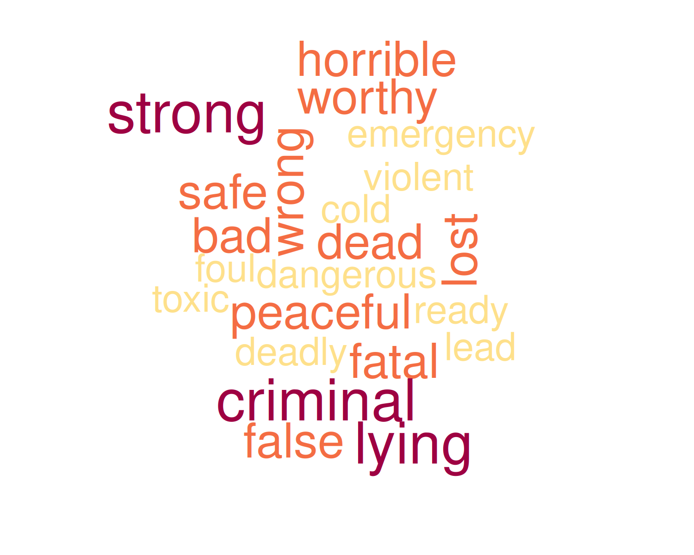
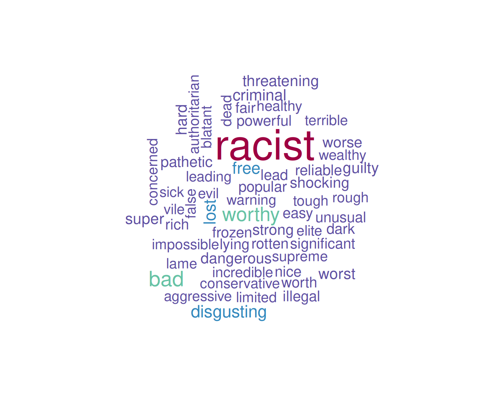
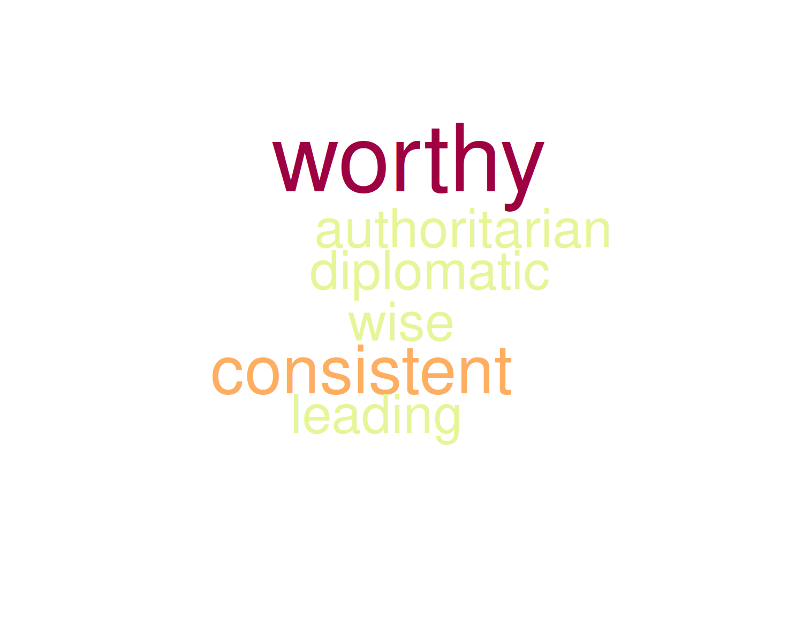

```{r}
#| message: false
#| warning: false
#| include: false
#| label: "load libs"
library(tidyverse)
library(flextable)
library(gridExtra)
library(ggplot2)
library(rtoot)
library(tidytext)
library(data.table)
library(grDevices) #png function
library(wordcloud)#wordcloud
library(RColorBrewer)
library(stopwords)
library(tidytext)
library(widyr)
library(igraph)
library(ggraph)
`%notin%` <- Negate(`%in%`)
```

```{css, echo=FALSE}

.infobox {
  padding: 1em 1em 1em 4em;
  margin-bottom: 10px;
  border: 2px solid #4f9ed4;
  border-radius: 10px;
  background: ##a3cde5 5px center/3em no-repeat;
}

.fig_legend {
  font-size: 0.8rem;
  line-height: 1.2;
}

.long_quote {
  font-size: 0.8rem;
  line-height: 1.2;
  padding: 1em 1em 1em 4em;
  margin-bottom: 10px;
  border: 2px solid #4f9ed4;
  border-radius: 10px;
  background: ##a3cde5 5px center/3em no-repeat;
}
```

# 💬 ¡Cuéntamelo todo.... pero con mates!

¿Te imaginas poder leer miles, o cientos de miles, de artículos o publicaciones en segundos?, ¿ser capaz de identificar temas, clasificar los documentos con base en su contenido, crear redes que nos ayuden a entender las relaciones entre los documentos e incluso explorar las emociones asociadas a cada publicación o tema de discusión? Suena atrevido, ¿verdad?

La **minería de textos** (*text mining*) es una rama de la Ciencia de Datos que nos ayuda a extraer información útil y patrones significativos de grandes volúmenes de texto no estructurado; es decir, texto que no sigue un formato predefinido, correos electrónicos, redes sociales, artículos, *chats* o documentos PDF. Esta disciplina combina técnicas de lingüística, estadística e inteligencia artificial para analizar los documentos, identificar tendencias, clasificar contenido y descubrir relaciones ocultas entre conceptos, temas y subtemas de contenido.

Al extraer patrones en el lenguaje que reflejan actitudes, emociones y comportamientos colectivos, la minería de datos nos ofrece una visión cuantitativa y cualitativa de los procesos sociales, ayudándonos a comprender dinámicas sociales complejas, movimientos políticos, cambios de opinión y fenómenos globales de forma rápida, económica y a escala masiva.

En nuestro mundo moderno, en el que los seres humanos dejamos registro de nuestras actividades y sentimientos en la red y volcamos todo nuestro conocimiento en Internet, la minería de textos se ha convertido en una herramienta invaluable para la disciplinas como la sociología y la psicología, la antropología y ciencias políticas, pues nos ayuda a mejorar la comprensión del comportamiento humano en contextos específicos y en tiempo real. En este contexto, las redes sociales se han convertido en una fuente de información increíblemente valiosa que nos permite conducir análisis cualitativos y cuantitativos a gran escala.

## El mastodonte de las redes sociales {style="font-size: 18px"}

[Mastodon](https://docs.joinmastodon.org/) es una red social descentralizada y de código abierto, similar a Twitter (ahora *X*) o Facebook, pero sin pertenecer a ninguna compañía ni corporación.

Mastodon funciona a través de servidores independientes (*instancias*) que se comunican entre sí. Cada *instancia* funciona como una comunidad virtual independiente con libertad para establecer sus propias reglas de moderación de contenido. A la fecha de publicación de este *post* existen 9,858 *instancias* de Mastodon con casi 10 millones de usuarios registrados.

Al ser una red social descentralizada, Mastodon prioriza la privacidad, el control del usuario y la libertad de moderación dentro cada comunidad virtual. A diferencia de redes sociales corporativas, Mastodon se aleja de algoritmos publicitarios y de filtrado de contenido o censura centralizada. Estas propiedades hacen de Mastodon una importante fuente de información sin sesgos.

## El señor de pelo color zanahoria y extraño copete... {style="font-size: 18px"}

Donald Trump​​​​​ es una figura pública controvertida. Su segunda presidencia comenzó el 20 de enero de 2025 cuando asumió su cargo como el 47.º presidente de los Estados Unidos. Su mandato se ha caracterizado por decisiones políticas inesperadas y la salida a la luz documentos que revelan altos niveles de corrupción gubernasmental a una escala insospechada.

En este post hemos decidido experimentar utilizando a "Donald Trump" como tema de discusión en un interesante ejercicio de minería de textos con Mastodon.

# 🦣 Conversando con el mastodonte

La librería [rtoot](https://cran.r-project.org/web/packages/rtoot/vignettes/rtoot.html) de [R](https://www.r-project.org/) nos permite conectarnos a Mastodon y descargar a nuestro entorno de programación las publicaciones (*posts*) públicas más recientes o bien aquellas que hayan sido etiquetadas utilizando *hashtags*.

Para este *post* utilizamos rtooth para descargar 20,000 publicaciones etiquetadas con el hastag *#trump*. Dentro de esta red social, cada publicación se denomina *toot*.

Como Mastodon es una red descentralizada, antes de descargar nada debemos elegir una i*nstancia* desde la cual obtendremos la información. En este caso hemos elegido la instancia *mastodon.social* ya que es el servidor más grande de la red, con más de 300,000 usuarios activos y más de 1.5 millones de cuentas registradas.

```         
```

::: {.infobox data-latex=""}
> 🔍 El objetivo de este análisis será identificar los temas de discusión relacionados con Donald Trump, descubrir aspectos emocionales asociados a ellos, así como su evolución en el tiempo.
:::

```         
```

```{r}
#| include: FALSE

# library(rtoot)
# #initialize public connection
# tkn <- auth_setup()
# # check connection
# get_instance_trends(instance = "mastodon.social")
# get_instance_activity(instance = "mastodon.social")
# 
# # get last 20000 toots on 18 feb 2026 @ 10:00 am Madrid time
# trump20k <- get_timeline_hashtag(hashtag = "trump",
#                               instance = "mastodon.social", limit = 20000)
# 
# glimpse(trump, width = 50)
```

```{r}
#| message: false
#| warning: false
#| include: false

#download.file(
#  url = "https://mega.nz/file/RlFjTRoK#Uyc0bizwrMMvIt_eNlmRJgudeRRk8TxV2TzEJVAQwbM",
#  destfile = "trump20k.rds"
#  )
              
trump <- read_rds("trump20k.rds") %>% mutate(id = as.character(id)) %>% 
  filter(language == "en" | language == "en-GB")
```

```{r}
#| include: false
# Clean the text

remove_html_tags <- function(text) {
  text <- str_remove_all(text, "<[^>]*>")
  return(text)
}

# select necessary columns
trump_clean <- trump %>% 
  select(id, created_at, content)

# Remove all CSS styling
trump_clean$content <- gsub("</?p[^>]*>", "", trump_clean$content, ignore.case = TRUE)
# remove @
trump_clean$content <- gsub("\\b[^\\s]*@[^\\s]*\\b", "", trump_clean$content, perl = TRUE)
# remove websites  https
trump_clean$content <-gsub("\\bhttps://[^\\s]+\\b", "", trump_clean$content, perl = TRUE)
# remove websites  http
trump_clean$content <-gsub("\\bhttp://[^\\s]+\\b", "", trump_clean$content, perl = TRUE)
# remove non-alphanumeric but keeps common punctuation
trump_clean$content <- gsub("[^a-zA-Z0-9 .,!?-]", "", trump_clean$content)

glimpse(trump_clean, width = 50)
```

```{r}
#| include: false

# Create tokens
trump_tokens <- unnest_tokens(tbl = trump_clean, output = "word", input = content, token = "words")

trump_tokens <- trump_tokens %>% anti_join(stop_words)  # remove stop words
trump_tokens <- trump_tokens %>% filter(!str_detect(word, "\\d")) # remove numbers
glimpse(trump_tokens, width = 50)
```

## Limpieza de los datos {style="font-size: 18px"}

Antes de comenzar con el análisis de temas de discusión, filtramos los *toots* para quedarnos únicamente con aquellos cuyo idioma de publicación fuera el inglés, lo que redujo el número de *toots* a 15,500. La fecha del primer *toot* recuperado, e incluido en el análisis, fue el 25 de enero de 2026, publicado a las 17:51 (hora de Madrid) y el último el 19 de febrero a las 12:14.

```{r}
#| include: false

# some stats
toot_stats <- trump_tokens %>% group_by(id) %>% count(id) %>% arrange(desc(n))
```

La extensión máxima de los *toots* fue de `r toot_stats$n %>% head(1)` palabras, la mínima de `r toot_stats$n %>% tail(1)`, con una media de `r mean(toot_stats$n) %>% round(2)` y desviación estándar de 54.55.

En la minería de textos más básica, como la que desarrollaremos en este *post*, la materia prima del análisis son las palabras aisladas, llamadas *tokens*, que componen un documento. Sin embargo, no nos interesan TODAS las palabras, sino únicamente aquellas que contienen significado. Por ello, todos los determinantes, pronombres, conjunciones, preposiciones, nexos, números, signos de puntuación y caracteres distintos de letras que deben ser eliminados del texto. En la minería de textos, estas palabras sin significado se denominan *stop words*.

En el caso de Mastodon, los enlaces a páginas web o a otras publicaciones generan códigos HTLM que también deben ser eliminados.

Tras eliminar las *stop words* y códigos HTML, las palabras de un texto son separadas una a una, dando como resultado una tabla con el identificador de la publicación, el *toot* en nuestro caso, asociado a cada palabra.

```{r}
#| echo: FALSE
trump_tokens %>%
  select(id, word) %>%
  setNames(c("ID toot", "Palabra")) %>% 
  head(10) %>%
  flextable() %>%
  add_header_lines("Tabla 1. Estructura de una tabla de tokens") %>%
  theme_zebra() %>%
  autofit()

```

La Tabla 1 muestra las 10 primeras líneas de la tabla de datos que contiene los *tokens* asociados a cada al primer *toot* de nuestro conjunto. Un vistazo a la tabla nos revela al existencia de "palabras" que carecen por completo de significado. Estas "palabras" son etiquetas HTML utilizadas por Mastodon para distintos fines, y también deben ser eliminadas.

Para poder identificar estas etiquetas, haremos una lista de las palabras que aparecen con mayor frecuencia en todas las publicaciones (Tabla 2).

```{r}
#| echo: FALSE
trump_tokens %>% 
  count(word, sort = TRUE) %>% 
  head(20) %>% 
  rownames_to_column(var = 'row') %>% 
  setNames(c("Posición", "Palabra", "n")) %>% 
  flextable::flextable() %>% 
  add_header_lines("Tabla 2. Lista de las 20 palabras más comunes") %>%
  theme_zebra() %>%
  autofit()
  
```

La Tabla 2 nos muestra que, efectivamente, estas etiquetas HTML de Mastodon son las palabras que aparecen con mayor frecuencia en las publicaciones. A partir de la posición número 16, comienzan a aparecer palabras que sí parecen guardar relación con Donald Trump.

```{r}
#| include: false
#| message: false
#| warning: false
# words that come from mastodon's tags and functions, select 15 by visual inspection
noise_words <- trump_tokens %>% 
  count(word, sort = TRUE) %>% 
  head(16) %>% pull(word)

# remove common words by visual inspection
trump_tokensClean <- trump_tokens %>%
  filter(word %notin% noise_words) %>% 
  filter(str_detect(word, "^target", negate = TRUE)) %>% # starts with target
  filter(str_detect(word, "^class", negate = TRUE)) %>% 
  filter(str_detect(word, "^reltags", negate = TRUE)) %>% 
  filter(str_detect(word, "^span", negate = TRUE)) %>% 
  filter(str_detect(word, "^translaten", negate = TRUE)) %>% 
  filter(str_detect(word, "^url$", negate = TRUE)) %>% #exact match
  filter(str_detect(word, "^les$", negate = TRUE)) %>% 
  filter(str_detect(word, "^ap$", negate = TRUE)) %>% 
  filter(str_detect(word, "^fr$", negate = TRUE)) %>% 
  filter(str_detect(word, "^dont$", negate = TRUE)) %>% 
  filter(str_detect(word, "^utmsource", negate = TRUE)) %>% 
  filter(str_detect(word, "^dass$", negate = TRUE)) %>% 
  filter(str_detect(word, "^di$", negate = TRUE)) %>% 
  filter(str_detect(word, "^ja$", negate = TRUE)) %>% 
  filter(str_detect(word, "^gtgt$", negate = TRUE)) %>% 
  filter(str_detect(word, "^mehr$", negate = TRUE)) %>% 
  filter(str_detect(word, "^isnt$", negate = TRUE)) %>% 
  filter(str_detect(word, "^hes$", negate = TRUE)) %>% 
  filter(str_detect(word, "^br$", negate = TRUE)) %>% 
  filter(str_detect(word, "^bra$", negate = TRUE)) %>% 
  filter(str_detect(word, "^ber$", negate = TRUE)) %>% 
  filter(str_detect(word, "^yure$", negate = TRUE)) %>% 
  filter(str_detect(word, "^inlinebrbrre$", negate = TRUE)) %>% 
  filter(str_detect(word, "^theyre$", negate = TRUE)) %>% 
  filter(str_detect(word, "^htmlspana$", negate = TRUE)) %>% 
  filter(str_detect(word, "^doesnt$", negate = TRUE)) %>% 
  filter(str_detect(word, "^didnt$", negate = TRUE)) %>% 
  filter(str_detect(word, "^donald$", negate = TRUE)) %>% 
  filter(str_detect(word, "^trumps$", negate = TRUE)) %>% 
  filter(str_detect(word, "^im$", negate = TRUE)) %>% 
  filter(str_detect(word, "^tag$", negate = TRUE)) %>% 
  filter(str_detect(word, "^tspan", negate = TRUE)) %>% 
  filter(str_detect(word, "^noopener", negate = TRUE)) %>% 
  filter(str_detect(word, "^posts$", negate = TRUE)) %>% 
  filter(str_detect(word, "^president$", negate = TRUE)) 
  

# Get stopwords from other languages
library(stopwords)
german_stopwords <- stopwords("de") %>% tibble() %>% setNames("word")
french_stopwords <- stopwords("fr") %>% tibble() %>% setNames("word")
spanish_stopwords <- stopwords("es") %>% tibble() %>% setNames("word")

# remove stop words
trump_tokensClean <- trump_tokensClean %>% anti_join(german_stopwords)
trump_tokensClean <- trump_tokensClean %>% anti_join(french_stopwords)
trump_tokensClean <- trump_tokensClean %>% anti_join(spanish_stopwords)

# Remove duplicated rows
trump_tokensClean <- trump_tokensClean %>% distinct()


totalNum_tokens <-  trump_tokensClean %>% nrow()
totalNum_tokens


```

Para cada publicación, eliminamos los *tokens* correspondientes a las etiquetas HTML, así como las palabras "donald", "trump" y "president", puesto que nuestro conjunto de datos ya fue creado con el *hastag* \#*trump* como tema principal.

A través de múltiples iteraciones identificamos "palabras" comunes que en realidad no guardan significado y las eliminamos de las lista de *tokens* de cada publicación (consultar el *script* de programación para ver la lista completa en el repositorio de [La Casa de Datos](https://github.com/lacasadedatos/R_scripts "Ver código del análisis") en Github).

Tras esta limpieza exhaustiva, y tras eliminar los tokens repetidos en cada publicación, el número total de *tokens* fue de `r totalNum_tokens`, con un total de `r trump_tokensClean$word %>% unique() %>% length()` palabras únicas. El número máximo de *tokens* por *toot* fue de 598 y el mínimo de 1. La media de tokens por toot fue de 17.7, con una desviación estándar de 24.21.

# 🖼️ Una imagen vale más que mil palabras...

Las nubes de palabras son una herramienta clásica de la minería de textos; nos ayudan a visualizar la frecuencia con la que aparece una palabra en u texto. Cuanto más común es una palabra en un texto más grande aparece en la nube. También podemos usar una escala de color ligada a su frecuencia. La Figura 1 muestra la nube de palabras asociadas a nuestro conjunto de toots.

```{r}
#| include: false
# Table with most common words
trump_tokenCounts <- trump_tokensClean %>% 
  count(word, sort = TRUE) %>% data.table::as.data.table()
```

```{r}
#| echo: FALSE
#| include: FALSE
# show table
trump_tokenCounts %>% head(30) %>% flextable()
```

```{r}
#| include: false
#| eval: false
# create word cloud of most common words

#wordcloud 546
set.seed(546)
png("wordcloud2_0K_en.png", width=5,height=4, units='in', res=300)
par(mar = rep(0, 4))
wordcloud(words = trump_tokenCounts$word, 
          freq = trump_tokenCounts$n,scale=c(3.5,0.25),
          max.words=70, 
          colors=rev(brewer.pal(10, "Spectral")))
```

<center>{width="500"}</center>

::: {.fig_legend data-latex=""}
**Figura 1**. Nube de palabras asociadas a Donald Trump, en publicaciones de Mastodon (mastodon.social) comprendidas entre el 25 de enero y el 19 de febrero de 2026. El tamaño de las palabras se corresponde con la frecuencia con la que aparecen en el conjunto de publicaciones.
:::

En la Figura 1 vemos que algunas de las palabras que aparecen con mayor frecuencia son "epstien" e "ice", seguidas de "amp" y "card". El resto de palabras podrían asociarse simplemente a la administración del gobierno estadounidense y a temas de carácter general.

A fecha de la publicación de este post, el nombre de Epstein ha aparecido incontables veces en los medios de comunicación tradicionales y en las redes sociales, como un criminal con lazos con altos cargos del gobierno de Estados Unidos y otros países que manejaba una red chantaje basada en la prostitución y abuso de niños y adolescentes. Búsquedas simples en Internet usando los términos *trump + ice*, *trump + amp* y *trump + card*, nos revelan que "ice" se refiere a la agencia americana de aduanas e inmigración ([Immigration and Customs Enforcement](https://www.ice.gov/), ICE). "AMP" podría referirse a la asociación de Musulmanes Americanos por Palestina ([American Muslims for Palestine](https://www.ampalestine.org/media/media-room/statements/amp-calls-trump-administration-immediately-restrain-israel-and-hold-it), AMP). Card podría hacer referencia a la llamada "[Trump Gold Card](https://trumpcard.gov/)", que es una forma acelerada de obtener la residencia americana de forma acelerada tras una contribución de 1 millón de dólares.

Las nubes de palabras no muestran su contexto y por si solas no son muy eficientes para ayudarnos a identificar temas de discusión. Esto se ve reflejado en la mayoría de las palabras de la Figura 1 podrían asociarse simplemente a temas administrativos del gobierno federal estadounidense.

```         
```

::: {.infobox data-latex=""}
> 🕸 Una de las debilidades de las nubes de palabras es que no muestran el contexto de las palabras. Por ello, recurrimos al análisis de redes para identificar con mayor precisión posibles temas de discusión.
:::

```         
```

```{r}
#| include: FALSE
#| message: false
#| warning: false
library(tidytext)
library(widyr)
library(igraph)
library(ggraph)

# make an exploratory function

gen_wordGraph <- function(tokensClean,
                          minimun_n,
                          mimimum_correlation) {
  
tokens_over_n <- tokensClean %>% 
  count(word) %>% 
  filter(n >= minimun_n)

word_correlations <- tokensClean %>%
  semi_join(tokens_over_n, by = "word") %>%
  # which words appear together in the same post
  pairwise_cor(item = word, feature = id) %>%
  filter(correlation >= mimimum_correlation)

graph_from_data_frame(d = word_correlations, # distance?
            vertices = tokens_over_n %>% # points
            # keep only words that are in the correlation DF
            semi_join(word_correlations, by = c("word" = "item1"))) %>% 
  ggraph(layout = "fr")+
  geom_edge_link() + # aes(alpha = correlation)
  geom_node_point()+
  geom_node_text(aes(label = name), # within aes add color = n
                 repel = TRUE,
                 size = 2.7)+
  theme_minimal()+
  theme(axis.title = element_blank())
  
}
```

# 🔬 Identificación de temas de discusión a través del análisis de redes

La librería [**igraph**](https://www.geeksforgeeks.org/r-language/network-visualization-in-r-using-igraph/) de R es una herramienta poderosa que nos permite abordar en análisis de textos a través de la visualización de redes (grafos). La red se construye a partir de los niveles de correlación de los tokens dentro de cada documento; en nuestro caso, cada toot: las palabras que aparecen juntas en muchos documentos tendrán un mayor grado de correlación que las palabras que aparecen juntas solo en unos cuantos.

La Figura 2 muestra una primera aproximación a la identificación de temas de discusión por análisis de redes, utilizando un grado de correlación de 0.2 y un mínimo de repeticiones de 100; es decir, que dos palabras aparezcan juntas en al menos 100 toots.

```{r}
#| echo: FALSE
#| message: false
#| warning: false
set.seed(1976)
gen_wordGraph(trump_tokensClean, 100, 0.2)
```

<center>{width="500"}</center>

::: {.fig_legend data-latex=""}
**Figura 2**. Análisis correlación de palabras (tokens) por redes. Cada punto corresponde a una palabra. La distancia entre puntos (en unidades arbitrarias) se corresponde con el grado de correlación entre palabras o grupos de palabras. El panel inferior corresponde a una ampliación de la nube de puntos que aparece en el centro de la imagen del panel superior.
:::

En la Figura 2 podemos comenzar a apreciar algunos conjuntos de puntos que parecen apuntar a ciertos temas de discusión. En la parte superior del grafo vemos las palabras "epstein" y "files" asociadas con otras palabras como "sex" y "child". Por mencionar algunos grupos de palabras, vemos también, en un conjunto, separado las palabras "iran", "nuclear", "talks" y "miliary"; así como "gaza", "board" y "peace" en otro conjunto.

Vemos además una gran conjunto central que podrían estar relacionadas con agencias de noticias, otras redes sociales o encabezados sensacionalistas. Dentro de este conjunto encontramos palabras como "hottest", "reddit", "fediverse", "rebreadcast", etc. Para refinar nuestro análisis de grafos eliminamos las palabras de esta nube de puntos, y aumentamos el número mínimo de repeticiones a 110 (Figura 3).

```{r}
#| include: false
trump_tokensClean2 <- trump_tokensClean %>%
 filter(str_detect(word, "^subreddit$", negate = TRUE)) %>%
 filter(str_detect(word, "^source$", negate = TRUE)) %>%
 filter(str_detect(word, "^rfednews$", negate = TRUE)) %>%
 filter(str_detect(word, "^hottest$", negate = TRUE)) %>%
 filter(str_detect(word, "^irritating.br$", negate = TRUE)) %>%
 filter(str_detect(word, "^robot$", negate = TRUE)) %>%
 filter(str_detect(word, "^fediverse$", negate = TRUE)) %>%
 filter(str_detect(word, "^source$", negate = TRUE)) %>%
 filter(str_detect(word, "^rebroadcast$", negate = TRUE)) %>%
 filter(str_detect(word, "^top$", negate = TRUE)) %>%
 filter(str_detect(word, "^posting$", negate = TRUE)) %>%
 filter(str_detect(word, "^rebroadcasts$", negate = TRUE)) %>%
 filter(str_detect(word, "^reddit$", negate = TRUE)) %>%
 filter(str_detect(word, "^workers.this$", negate = TRUE)) %>%
 filter(str_detect(word, "^affiliated$", negate = TRUE)) %>%
 filter(str_detect(word, "^resentbrunaffiliated$", negate = TRUE)) %>%
 filter(str_detect(word, "^post$", negate = TRUE)) %>%
 filter(str_detect(word, "^altpsbr$", negate = TRUE)) %>%
 filter(str_detect(word, "^altnpsbr$", negate = TRUE)) %>%
 filter(str_detect(word, "^natl$", negate = TRUE)) %>%
 filter(str_detect(word, "^brfrom$", negate = TRUE)) %>%
 filter(str_detect(word, "^char$", negate = TRUE)) %>%
 filter(str_detect(word, "^volume$", negate = TRUE))

```

```{r}
#| echo: FALSE

# improved function with  additional visual parameters
gen_wordGraph2 <- function(tokensClean,
                          minimun_n,
                          mimimum_correlation) {
  
tokens_over_n <- tokensClean %>% 
  count(word) %>% 
  filter(n >= minimun_n)

word_correlations <- tokensClean %>%
  semi_join(tokens_over_n, by = "word") %>%
  # which words appear together in the same post
  pairwise_cor(item = word, feature = id) %>%
  filter(correlation >= mimimum_correlation)

graph_from_data_frame(d = word_correlations, # distance
            vertices = tokens_over_n %>% # points
            # keep only words that are in the correlation DF
            semi_join(word_correlations, by = c("word" = "item1"))) %>% 
  ggraph(layout = "fr")+
  geom_edge_link(aes(color = correlation)) + # aes(alpha = correlation)
  geom_node_point()+
  geom_node_text(aes(color = n, label = name), # within aes add color = n
                 repel = TRUE, size = 2.7,)+
   scale_color_gradient(low = "#4f9ed4", high = "#db4646") +
  theme_minimal()+
  theme(axis.title = element_blank())
  
}
set.seed(1234)
gen_wordGraph2(trump_tokensClean2, 110, 0.2)+
  ggtitle("General topics")
```

::: {.fig_legend data-latex=""}
**Figura 3**. Identificación de temas de discusión generales (general topics) por análisis correlación de palabras (tokens) por redes tras la eliminación de palabras irrelevantes. Cada punto corresponde a una palabra. La distancia entre puntos (en unidades arbitrarias) se corresponde con el grado de correlación entre palabras o grupos de palabras. El color de las palabras corresponde al número de veces que aparecen en el conjunto de toots. El color de las líneas se corresponde con el grado de correlación entre las palabras.
:::

Tras eliminar las palabras irrelevantes a aumentar ligeramente el número mínimo de repeticiones tenemos grupos de palabras que comienzan a estructurar claramente temas de discusión.

Tomando como referencia el número de publicaciones en el que aparecen las palabras, destacan las redes relacionadas con Epstein y con la agencia americana de aduanas e inmigración ICE que ya mencionamos arriba. En este último conjunto de palabras aparecen las palabras "alex", "pretti", "shooting" y "killing", que se relacionan con el [asesinato de Alex Pretti](https://abcnews.com/US/alex-pretti-icu-nurse-killed-federal-agent-minneapolis/story?id=129525591) por parte de agentes de ICE en Minnesota, ocurrido el 24 de enero de 2026.

A nivel del grado de correlación, destaca el grupo de palabras que contiene "kai", "granddaugther", "worthy", "lpga" y "event". La palabra "lpga" corresponde a la asociación femenina de golf profesional ([Ladies Professional Golf Association](https://www.lpga.com/), LPGA) dentro de la que participa la nieta de Donald Trump llamada [Kai](https://en.wikipedia.org/wiki/Kai_Trump).

Otros temas de discusión evidentes se relacionan con Rusia, China y Ucrania; con la junta de paz de Gaza (Gaza Peace Board) y con asuntos militares y nucleares relacionados con Irán. Además, Algunos pares de palabras aislados, como "tarifs" y "trade", o "white" y "house", identifican otros posibles temas de discusión.

```         
```

::: {.infobox data-latex=""}
> 👓 El análisis de redes nos ha permitido identificar claramente algunos temas de discusión... ¿Pero podemos ir más allá? ¿Podemos identificar subtemas utilizando análisis de redes?
:::

```         
```

## El caso de Jeffrey Epstein {style="font-size: 18px"}

Ya hemos visto que la palabra Epstein no solo es la más común en nuestro conjunto de toots, sino que además, el análisis de redes a señalado a esta palabra como un nodo importante de un tema de discusión.

Para identificar subtemas, filtramos todos aquellos toots que contienen la palabra Epstein (1136 toots) y repetimos el análisis de redes (Figura 4). A través de ensayo y error, ajustamos los parámetros del grafo a un mínimo de 30 repeticiones, y un nivel de correlación de 0.27, para encontrar un balance entre el número de nodos y la claridad de las relaciones entre ellos.

```{r}
#| echo: FALSE
epstein_posts <- trump_tokensClean2 %>% filter(word == "epstein")
  
epstein_tokens <- epstein_posts %>% inner_join(trump_tokensClean2, by = "id") %>% 
  select(1, 5) %>% 
  setNames(c("id", "word"))


set.seed(48)
gen_wordGraph2(epstein_tokens, 30, 0.27)+
  ggtitle("Epstein topics")
```

::: {.fig_legend data-latex=""}
**Figura 4**. Identificación de temas de discusión (topics) por análisis correlación de palabras (tokens) por redes, utilizando únicamente los toots que contienen la palabra "epstein". Cada punto corresponde a una palabra. La distancia entre puntos (en unidades arbitrarias) se corresponde con el grado de correlación entre palabras o grupos de palabras. El color de las palabras corresponde al número de veces que aparecen en el conjunto de toots. El color de las líneas se corresponde con el grado de correlación entre las palabras.
:::

En la Figura 4 podemos identificar claramente algunos subtemas de discusión. En un conjunto de puntos aparece el nombre de Epstein relacionado con la [Casa Blanca y el abuso sexual de mujeres y niños](https://www.pbs.org/newshour/nation/the-latest-epstein-files-release-includes-famous-names-and-new-details-about-an-earlier-investigation). Dentro de otro conjunto encontramos el nombre de la Fiscal [General Pam Bondi quien lleva el caso Epstein](https://www.bbc.com/news/articles/cq6ql2n917zo) y que a través del departamento de justicia de Estados Unidos sacó a la luz millones de documentos de la red de tráfico sexual y pedofilia que revelan lazos entre el fallecido Jeffrery Epstein y personalidades como [Elon Musk](https://www.theguardian.com/technology/2026/jan/30/elon-musk-epstein-files-island-visits), el secretario de comercio estadounidense [Howard Lutnick](https://www.cbsnews.com/news/howard-lutnick-jeffrey-epstein-in-business-together/)

## El asesinato de Alex Pretti por agentes de ICE {style="font-size: 18px"}

Ya vimos que la palabra "ICE" (la agencia americana de aduanas e inmigración) tiene también cierto protagonismo en nuestra nube de palabras (Figura 1) y es además la segunda más común en el conjunto de publicaciones, con 1073 toots. Al igual que la palabra "Epstein", "ICE" representa un tema de discusión independiente en nuestro análisis de redes (Figura 3).

Para identificar subtemas, filtramos aquellos toots que contienen la palabra ICE y repetimos el análisis de redes (Figura 5). A través de ensayo y error, ajustamos los parámetros del grafo a un mínimo de 30 repeticiones, y un nivel de correlación de 0.3, para encontrar un balance entre el número de nodos y la claridad de las relaciones entre ellos.

```{r}
#| echo: FALSE
ice_posts <- trump_tokensClean2 %>% filter(word == "ice")
  
ice_tokens <- ice_posts %>% inner_join(trump_tokensClean2, by = "id") %>% 
  select(1, 5) %>% 
  setNames(c("id", "word"))


set.seed(1234)
gen_wordGraph2(ice_tokens, 30, 0.3)+
  ggtitle("ICE topics")
```

::: {.fig_legend data-latex=""}
**Figura 5**. Identificación de temas de discusión (topics) por análisis correlación de palabras (tokens) por redes, utilizando únicamente los toots que contienen la palabra "ICE" (las siglas de la agencia americana de aduanas e inmigración). Cada punto corresponde a una palabra. La distancia entre puntos (en unidades arbitrarias) se corresponde con el grado de correlación entre palabras o grupos de palabras. El color de las palabras corresponde al número de veces que aparecen en el conjunto de toots. El color de las líneas se corresponde con el grado de correlación entre las palabras.
:::

En la Figura 5 podemos identificar claramente algunos subtemas. Junto al nombre de [Alex Pretti](https://msmagazine.com/2026/01/27/renee-good-alex-pretty-cruel-unusual-punishment-first-eight-amendment/) aparece el nombre de [Renee (Good)](https://www.nytimes.com/2026/01/10/us/rennee-good-ice-shooting-minnesota.html), otra ciudadana de Minnesota asesinada por agentes de ICE apenas dos semana antes que Alex Pretti. En la Figura 5 podemos identificar a la agencia ICE con protestas, derechos políticos y "maga". MAGA ([Make America Great Again](https://www.britannica.com/topic/MAGA-movement)) es un movimiento nativista ligado al Partido Republicano americano que ha sido acusado de homofobia, racismo y sexismo, que ha salido en [defensa de las acciones de los agentes de ICE](https://www.wired.com/story/maga-trump-rewriting-ice-shooting-minneapolis/), a pesar de la [evidencia en vídeo](https://www.huffpost.com/entry/same-video-different-story-ice-minnesota_l_69611f3be4b0a26aea5a2d8b) del uso de violencia letal no justificada por su parte. El nombre [Kristi Noem](Kristi%20Noem%20is%20the%208th%20Secretary%20of%20the%20Department%20of%20Homeland%20Security), la octava secretaria del Departamento de Seguridad Nacional, el organismo encargado de supervisar a la agencia ICE.

```         
```

::: {.infobox data-latex=""}
> ⚗️ El análisis de redes nos ha permitido identificar claramente temas y subtemas de discusión asociados a las palabras más comunes dentro de nuestro conjunto de 20,000 toots, todos relacionados con Donald Trump... ¡Estupendo! Pero... ¿Podemos explorar la cara emocional de estos toots? ¿Tal vez incluso la cara emocional de cada tema?...
:::

```         
```

# 💖 Análisis de sentimientos

Para poder explorar las emociones asociadas a los temas de discusión utilizamos los llamados "diccionarios de sentimientos". Estos son tablas de palabras a las que se les ha asociado un aspecto emocional. En un diccionario de sentimientos básico, cada palabra del diccionario está etiquetada como "positiva" o "negativa"; por ejemplo, bueno - positivo, malo - negativo. En diccionarios más complejos, además de la etiqueta "positiva" o "negativa" cada palabra tiene asociada una emoción, como confianza, dicha, asco o ira.

```{r}
#| message: false
#| warning: false
#| include: FALSE
#| echo: false

# Load English adjectives
adjectives <- read_csv("eng_adjectives.csv")

trump_ajdectives <- trump_tokensClean2 %>% semi_join(adjectives)

#get dictionary
sentiments_nrc <- get_sentiments("nrc")
sentiments_bing <- get_sentiments("bing")
unique(sentiments_nrc$word) %>% length()
unique(sentiments_bing$word) %>% length()
```

Para este análisis trabajamos con dos diccionarios para la lengua inglesa:

-   El diccionario [Bing](https://emilhvitfeldt.github.io/textdata/reference/lexicon_bing.html), que categoriza las palabras de forma binaria en positivas y negativas, con un total de `r unique(sentiments_bing$word) %>% length()` palabras etiquetadas.

-   El diccionario [NRC](https://saifmohammad.com/WebPages/NRC-Emotion-Lexicon.htm), que además de clasificar las palabras como positivas o negativas, las asocia con ocho emociones básicas según [Plutchik](https://en.wikipedia.org/wiki/Robert_Plutchik#Plutchik's_wheel_of_emotions) (ira, miedo, anticipación, confianza, sorpresa, tristeza, alegría y asco), con un total de `r unique(sentiments_nrc$word) %>% length()` palabras etiquetadas.

Ambos diccionarios de sentimientos incluyen sustantivos, adjetivos, verbos y adverbios. Para explorar mejor las emociones asociadas al conjunto te toots, aplicamos un filtra al conjunto de tokens para recuperar únicamente aquellos que corresponden a adjetivos, ya que esta categoría de palabras tiene mayor contenido emocional que los sustantivos.

La [lista de adjetivos](https://patternbasedwriting.com/elementary_writing_success/list-4800-adjectives/) que usamos para recuperar los adjetivos contenidos en nuestro conjunto de toots contiene un total de 4840 palabras. Tras aplicar este filtro, obtenemos un total de 34,264 tokens provenientes de 10,997 toots.

## Polos opuestos {style="font-size: 18px"}

Tras etiquetar cada uno de los adjetivos de nuestros toots como "positivos" o "negativos", según el diccionario Bing, creamos dos nubes de palabras. Una partiendo de los adjetivos "positivos" (4393 tokens, Figura 6) y otra de los "negativos" (6492 tokens, Figura 7).

```{r}
#| message: false
#| warning: false
#| include: FALSE
#| echo: false
#| 
trump_sentsAdjectives <- trump_ajdectives %>% 
  inner_join(sentiments_bing) %>% 
  mutate(sentiment = factor(sentiment))

# positive vs negative analysis
trump_pos_vs_neg <- trump_sentsAdjectives %>% 
  filter(sentiment == "positive" | sentiment == "negative")

trump_pos_vs_neg %>%
  count(sentiment) %>%
  flextable() %>%
  theme_zebra() %>%
  autofit()
```

```{r}
#| include: FALSE
#| eval: false

# wordcloud of positive adjectives
trump_posAdjectives <- trump_sentsAdjectives %>% 
  filter(sentiment == "positive")
trump_posAdjCounts <- trump_posAdjectives %>% 
  count(word, sort = TRUE) %>% 
  data.table::as.data.table()

set.seed(154)
png("trump_WcPosAdjs.png", width=5,height=4, units='in', res=300)
par(mar = rep(0, 4))
wordcloud(words = trump_posAdjCounts$word, 
          freq = trump_posAdjCounts$n,scale=c(3.5,0.25),
          max.words=70, 
          colors=rev(brewer.pal(10, "Spectral")))

```

<center>{width="500"}</center>

::: {.fig_legend data-latex=""}
**Figura 6**. Nube de adjetivos "positivos" en publicaciones de Mastodon (mastodon.social) comprendidas entre el 25 de enero y el 19 de febrero de 2026, relacionadas con Donald Trump. El tamaño de las palabras se corresponde con la frecuencia con la que aparecen en el conjunto de publicaciones.
:::

```{r}
#| include: FALSE
#| eval: false
# wordcloud of positive adjectives
trump_negAdjectives <- trump_sentsAdjectives %>% 
  filter(sentiment == "negative")
trump_negAdjCounts <- trump_negAdjectives %>% 
  count(word, sort = TRUE) %>% 
  data.table::as.data.table()

set.seed(148)
png("trump_WcNegAdjs.png", width=5,height=4, units='in', res=300)
par(mar = rep(0, 4))
wordcloud(words = trump_negAdjCounts$word, 
          freq = trump_negAdjCounts$n,scale=c(3.5,0.25),
          max.words=70, 
          colors=rev(brewer.pal(10, "Spectral")))
```

<center>{width="500"}</center>

:::: {.fig_legend data-latex=""}
::: {.fig_legend data-latex=""}
**Figura 7**. Nube de adjetivos "positivos" en publicaciones de Mastodon (mastodon.social) comprendidas entre el 25 de enero y el 19 de febrero de 2026, relacionadas con Donald Trump. El tamaño de las palabras se corresponde con la frecuencia con la que aparecen en el conjunto de publicaciones.
:::
::::

Es importante tener en cuenta que, aunque las Figuras 6 y 7 contienen los calificativos más comunes asociados a los toots relacionados con Donald Trump, ésto no significa que estén siendo usados para calificarlo a él directamente. Las Figuras 6 y 7 son simplemente un panorama de los calificativos "positivos" y "negativos" más comunes utilizados para hablar de distintos temas (Figuras 3-5).

## Ampliamos la gama emocional {style="font-size: 18px"}

Podemos profundizar un poco más en los aspectos emocionales de estos toots, utilizando el diccionario de sentimientos NRC, asociando a cada token una de las ocho emociones básicas: ira, miedo, anticipación, confianza, sorpresa, tristeza, alegría y asco. La Figura 8 muestra el número de adjetivos asociados a cada una de estas emociones dentro del conjunto de toots.

```{r}
#| include: FALSE
#| echo: FALSE
fullSents_Adjs <- trump_ajdectives %>%
  inner_join(sentiments_nrc) %>%
  filter(sentiment %notin% c("positive", "negative")) # Filter out extremes

fullSents_AdjCounts <- trump_ajdectives %>%
  inner_join(sentiments_nrc) %>%
  filter(sentiment %notin% c("positive", "negative")) %>% 
  count(sentiment, sort = TRUE) %>% 
  mutate(sentiment = factor(sentiment, levels = rev(sentiment)))
```

```{r}
#| echo: FALSE
ggplot(fullSents_AdjCounts) +
  aes(x = sentiment, y = n, fill = n) +
  geom_col() +
  scale_fill_gradient() +
  coord_flip() +
  theme_minimal()

```

:::: {.fig_legend data-latex=""}
::: {.fig_legend data-latex=""}
**Figura 8**. Frecuencia de adjetivos asociados a cada una de las 8 emociones básicas de Plutchik, en publicaciones de Mastodon (mastodon.social) comprendidas entre el 25 de enero y el 19 de febrero de 2026, relacionadas con Donald Trump. Trust, confianza; fear, miedo; anger, ira; sadness, tristeza; disgust, asco; anticipation, anticipación; joy, alegría; surprise, sorpresa.
:::
::::

La figura 8 muestra que, partiendo de los adjetivos, las emociones más comunes en los toots fueron la confianza (trust) y el miedo (fear).

# 🫱🏽‍🫲🏿 🧟 Identificación de temas relacionados con la confianza y el miedo

Nuestro primer paso fue identificar aquellos toots en los que aparecieran los 20 adjetivos más comunes asociados a la confianza y el miedo; la lista de estos adjetivos se muestra en la Tabla 3.

```{r}
#| echo: FALSE
top20_trustAdjs <- fullSents_Adjs %>% 
  filter(sentiment == "trust") %>% 
  count(word, sort = TRUE) %>%
  setNames(c("Confianza", "n_conf")) %>% 
  head(20) 

top20_fearAdjs <- fullSents_Adjs %>% 
  filter(sentiment == "fear") %>% 
  count(word, sort = TRUE) %>%
  setNames(c("Miedo", "n_miedo")) %>% 
  head(20)

tibble(top20_trustAdjs, top20_fearAdjs) %>% 
  flextable::flextable() %>% 
  add_header_lines("Tabla 3. Lista de los 20 adjetivos más comunes asociados a las emociones de confianza o miedo") %>%
  theme_zebra() %>%
  flextable::align(align = "left",
                   part = c("all")) %>% 
  autofit()
```

```{r}
#| echo: FALSE
#| include: false
# extract top 20 most common adjectives
top20_trust <- fullSents_Adjs %>% 
  filter(sentiment == "trust") %>% 
  count(word, sort = TRUE) %>%
  head(20)

top20_fear <- fullSents_Adjs %>% 
  filter(sentiment == "fear") %>% 
  count(word, sort = TRUE) %>%
  head(20)

top20_joy <- fullSents_Adjs %>% 
  filter(sentiment == "joy") %>% 
  count(word, sort = TRUE) %>%
  head(20)


# identify toots using these adjectives
trusty_toots <- trump_tokensClean2 %>% 
  inner_join(top20_trust) %>% 
  pull(id) %>% 
  unique()


fear_toots <- trump_tokensClean2 %>% 
  inner_join(top20_fear) %>% 
  pull(id) %>% 
  unique()

joy_toots <- trump_tokensClean2 %>% 
  inner_join(top20_joy) %>% 
  pull(id) %>% 
  unique()

# get tokens from these toots
trust_tokens <- trump_tokensClean2 %>% 
  filter(id %in% trusty_toots)

fear_tokens <- trump_tokensClean2 %>% 
  filter(id %in% fear_toots)

joy_tokens <- trump_tokensClean2 %>% 
  filter(id %in% joy_toots)
```

Identificamos 2040 toots que contienen alguna de las palabras asociadas a confianza (con un total de 66,779 tokens) y 1634 toots que contienen alguna de las palabras asociadas a miedo (con un total de 60,062 tokens). Tras aislar estos dos conjuntos de toots, identificamos los temas de discusión contenidos en ellos a través de un análisis de redes (Figuras 9 y 10).

```{r}
#| echo: FALSE
set.seed(1976)
gen_wordGraph2(trust_tokens, 70, 0.3)+
  ggtitle("Trust topics")
```

::: {.fig_legend data-latex=""}
**Figura 9**. Identificación de temas de discusión (topics) por análisis correlación de palabras (tokens) por redes, utilizando únicamente los toots que contienen adjetivos asociados a confianza (trust). Cada punto corresponde a una palabra. La distancia entre puntos (en unidades arbitrarias) se corresponde con el grado de correlación entre palabras o grupos de palabras. El color de las palabras corresponde al número de veces que aparecen en el conjunto de toots. El color de las líneas se corresponde con el grado de correlación entre las palabras.
:::

La Figura 9 muestra claramente un conjunto de palabras relacionado con [la participación de Kai trump](https://www.fogolf.com/1158845/is-donald-trumps-granddaughter-kai-worthy-of-place-in-lpga-event-499/), nieta de Donald Trump, en la liga femenina de golf que mencionamos arriba. Este conjunto de palabras contiene las palabras más comunes y con el más alto grado de correlación dentro de todos los toots asociados al sentimiento de confianza.

La Figura 9 muestra también un conjunto aislado de palabras relacionado con la agencia ICE, cuyos agentes abatieron tiros a un ciudadano americano a finales de enero de 2026 de forma aparentemente injustificada. Resulta entonces un tanto paradójico que este tema parezca relacionado con sentimientos de confianza.

Cuando identificamos los subtemas asociados al asesinato de Alex Pretti (Figura 5), apareció el término MAGA ([Make America Great Again](https://www.britannica.com/topic/MAGA-movement)), movimiento que ha defendido la actuación de los agentes de ICE. La presencia de MAGA dentro de los subtemas de discusión asociados a Alex Pretti podría explicar por qué este tema de aparece relacionado a la confianza en la Figura 9. Por otra lado, la Tabla 3 contiene palabras como "official", "legal", "constitutional", "economy", "personal", etc., que podrían asociarse de forma neutral a cualquiera de las palabras que componen el conjunto más grande de palabras de la Figura 9, puesto que muchas de ellas tiene un carácter puramente administrativo.

```{r}
#| echo: FALSE
set.seed(48)
gen_wordGraph2(fear_tokens, 50, 0.32)+
  ggtitle("Fear topics")
```

::: {.fig_legend data-latex=""}
**Figura 10**. Identificación de temas de discusión (topics) por análisis correlación de palabras (tokens) por redes, utilizando únicamente los toots que contienen adjetivos asociados al miedo (fear). Cada punto corresponde a una palabra. La distancia entre puntos (en unidades arbitrarias) se corresponde con el grado de correlación entre palabras o grupos de palabras. El color de las palabras corresponde al número de veces que aparecen en el conjunto de toots. El color de las líneas se corresponde con el grado de correlación entre las palabras.
:::

La Figura 10 identifica tres al menos temas de discusión asociados con miedo: el asesinato de Alex Pretti, Irán y Jeffrey Epstein. Aparece además un nuevo subtema con las palabras "bad", "bunny" y "super", que podría hacer referencia a la controvertida actuación del rapero [Bad Bunny en el Super Bowl](https://eu.usatoday.com/story/sports/nfl/2026/02/07/why-are-people-mad-bad-bunny-performing-super-bowl-halftime/88437960007/) el 9 de febrero. Bad Bunny ha sido un crítico de la administración de Donald Trump y de la agencia ICE. Los simpatizantes de Trump, por su parte, lo consideran un personaje anti-americano.

```         
```

::: {.infobox data-latex=""}
> 📺 El análisis de sentimientos, combinado con el análisis de redes, nos ha permitido identificar claramente nuevos temas de discusión, así como las emociones asociadas a ellos. Pero... ¿podemos evaluar la evolución de los sentimientos a lo largo del tiempo?...
:::

```         
```

# 🗓️ Evolución de sentimientos a lo largo del tiempo

Para evaluar la evolución de sentimientos a lo largo del tiempo, volvemos a hacer uso del diccionario Bing y la lista de adjetivos extraídos de nuestro conjunto de toots.

El diccionario Bing etiqueta cada palabra como "positiva" o "negativa". Asignando el valor de +1 a cada uno de los calificativos "positivos" y un valor de -1 a los "negativos" podemos extraer una métrica de la "carga emocional" de un determinado conjunto de toots; en nuestro caso, la media.

Para evaluar la evolución de la carga emocional de los toots en el tiempo, los agrupamos por fecha de publicación, usando un día como unidad de tiempo. La Figura 11 muestra el valor medio de la carga emocional de los toots para cada día del análisis.

```{r}
#| include: FALSE
#| echo: FALSE
trump_pos_vs_neg <- trump_pos_vs_neg %>% 
  mutate(value = if_else(sentiment == "positive", 1, -1)) %>% 
  mutate(date =  as_date(trump_pos_vs_neg$created_at)) %>% 
  filter(date != "2025-08-26") %>% 
  arrange(date)
```

```{r}
#| message: false
#| warning: false
#| echo: FALSE
sent_byDate <- trump_pos_vs_neg %>% 
  group_by(date) %>%
  summarise(mean_sent = mean(value))


ggplot(sent_byDate) +
  aes(x = date, y = mean_sent, fill = mean_sent) +
  geom_bar(stat = "summary", fun = "sum") +
  scale_fill_gradient(low = "#db4646", high = "#24b3d0") +
  scale_y_continuous(limits = c(-0.5, 0.5))+
  scale_x_date(breaks = "2 day", 
    labels = scales::date_format("%b %d")) +
  coord_flip()+
  theme_minimal()+
  labs(
    x = "Date",
    y = "Mean emotional load",
    fill = "Sentiment"
  )
```

::: {.fig_legend data-latex=""}
**Figura 11**. Análisis de la carga emocional de los toots publicados cada día entre el 25 de enero y el 19 de febrero de 2026 (Date). Cada uno de los adjetivos contenidos en el conjunto total de toots fué etiquetado como "positivo" o "negativos" de acuerdo al diccionario de sentimientos Bing. A los calificativos positivos se les asignó el valor de +1 y a los negativos -1 y posteriormente se calculó la media (Mean emotional load). El color de las barras corresponde al valor de la carga emocional; los valores negativos tienden al rojo y los positivos al azul.
:::

La Figura 11 muestra que, excepto por el 19 de febrero, la carga emocional contenida en los toots de cada día de análisis es negativa. Destacan el 25 de enero y el 6 de febrero como las fechas con la carga emocional más negativa y el 19 de febrero como el único día con una carga emocional positiva.

```         
```

::: {.infobox data-latex=""}
> 📆 Analizar la carga emocional asociada a los toots a lo largo del tiempo nos he permitido identificar respuestas emocionales positivas o negativas en fechas concretas... ¿Podemos asociar esas respuestas emocionales a eventos concretos?...
:::

```         
```

## Enero 25 {style="font-size: 18px"}

El número de toots recuperados del 25 de enero fue de 251, con 5269 tokens. La Figura 12 muestra los temas de discusión del 25 de enero a través del análisis de redes. Al igual que con los gráficos de redes anteriores, a través de ensayo y error, ajustamos el número mínimo de repeticiones a 10 repeticiones y el nivel de correlación a 0.35.

```{r}
#| message: false
#| warning: false
#| echo: FALSE
#| include: FALSE

trump_january2 <- trump_tokensClean2 %>%
  mutate(date = as_date(created_at)) %>%
  filter(date != "2025-08-26") %>% 
  filter(date == "2026-01-25")
```

```{r}
#| echo: FALSE
set.seed(48)
gen_wordGraph2(trump_january2, 10, 0.35)+
  ggtitle("Topics Jan. 25th")
```

::: {.fig_legend data-latex=""}
**Figura 12**. Identificación de temas de discusión (topics) por análisis correlación de palabras (tokens) por redes, utilizando únicamente los toots publicados el 25 de enero (Jan. 25th) de 2026. Cada punto corresponde a una palabra. La distancia entre puntos (en unidades arbitrarias) se corresponde con el grado de correlación entre palabras o grupos de palabras. El color de las palabras corresponde al número de veces que aparecen en el conjunto de toots. El color de las líneas se corresponde con el grado de correlación entre las palabras.
:::

En la Figura 12 , el tema de discusión que emerge es, nuevamente, el asesinato de [Alex Pretti](https://abcnews.com/Politics/minute-minute-timeline-fatal-shooting-alex-pretti-federal/story?id=129547199), lo que no resulta en modo alguno sorprendente, ya que este hecho ocurrió precisamente el 24 de enero.

También podemos visualizar la cara emocional de los toots publicados en esta fecha, utilizando los tokens correspondientes a los adjetivos contenidos en ellos (Figura 13).

```{r}
#| include: FALSE
#| echo: FALSE
jan25_sentsCounts <- trump_sentsAdjectives %>%  
  mutate(date =  as_date(trump_sentsAdjectives$created_at)) %>% 
  filter(date == "2026-01-25") %>% 
  count(word, sort = TRUE) %>%
  data.table::as.data.table()
```

```{r}
#| include: FALSE
#| eval: false
set.seed(48)
png("jan25_sents.png", width=5,height=4, units='in', res=300)
par(mar = rep(0, 4))
wordcloud(words = jan25_sentsCounts$word, 
          freq = jan25_sentsCounts$n,scale=c(2.5,0.4),
          max.words=70, 
          colors=rev(brewer.pal(10, "Spectral")))
```

<center>{width="500"}</center>

:::: {.fig_legend data-latex=""}
::: {.fig_legend data-latex=""}
**Figura 13**. Nube de adjetivos contenidos en las publicaciones de Mastodon (mastodon.social) del 25 de enero de 2026, relacionadas con Donald Trump. El tamaño de las palabras se corresponde con la frecuencia con la que aparecen en el conjunto de publicaciones.
:::
::::

A pesar de la subjetividad subyacente en la interpretación de cualquier hecho que tenga un componente emocional, podríamos decir que los calificativos usados para hablar de los hechos relacionados con Alex Pretti se corresponden con la naturaleza de los propios hechos.

## Febrero 6 {style="font-size: 18px"}

El número de toots recuperados del 06 de febrero fue de 737, con 13,098 tokens. La Figura 14 muestra los temas de discusión del 6 de febrero a través del análisis de redes.Al igual que con los gráficos de redes anteriores, a través de ensayo y error, ajustamos el número mínimo de repeticiones a 15 repeticiones y el nivel de correlación a 0.35.

```{r}
#| message: false
#| warning: false
#| echo: FALSE
#| include: FALSE

trump_feb6 <- trump_tokensClean2 %>%
  mutate(date = as_date(created_at)) %>%
  filter(date != "2025-08-26") %>% 
  filter(date == "2026-02-06")
```

```{r}
#| echo: FALSE
set.seed(48)
gen_wordGraph2(trump_feb6, 15, 0.35)+
  ggtitle("Topics Feb. 6th")
```

::: {.fig_legend data-latex=""}
**Figura 13**. Identificación de temas de discusión (topics) por análisis correlación de palabras (tokens) por redes, utilizando únicamente los toots publicados el 6 de febrero (Feb. 6th) de 2026. Cada punto corresponde a una palabra. La distancia entre puntos (en unidades arbitrarias) se corresponde con el grado de correlación entre palabras o grupos de palabras. El color de las palabras corresponde al número de veces que aparecen en el conjunto de toots. El color de las líneas se corresponde con el grado de correlación entre las palabras.
:::

En la Figura 13 se distinguen claramente dos temas de discusión, uno que contiene las palabras más comunes dentro del conjunto de toots ("video", "obamas", "racist") y otro relacionado con [Kai Trump y su participación en la liga femenina de golf](https://www.fogolf.com/1158845/is-donald-trumps-granddaughter-kai-worthy-of-place-in-lpga-event-499/) que ya hemos mencionado antes. La partipación de Kai Trump en esta liga se anunció precisamente en esta fecha.

Tras una sencilla búsqueda en Internet usando los términos "video", "obamas" y "racist" encontramos la publicación y eliminación posterior de un [vídeo publicado en las redes sociales de Donald Trump](https://www.firstpost.com/explainers/trump-shares-obama-ape-video-racist-imagery-history-13977245.html)en donde el expresidente americano Barak Obama y su esposa, ambos afroamericanos, aparecían retratados como simios.

Podemos visualizar la cara emocional de los toots publicados en esta fecha, utilizando los tokens correspondientes a los adjetivos contenidos en ellos (Figura 14).

```{r}
#| include: FALSE
#| echo: FALSE
feb6_sentsCounts <- trump_sentsAdjectives %>%  
  mutate(date =  as_date(trump_sentsAdjectives$created_at)) %>% 
  filter(date == "2026-02-06") %>% 
  count(word, sort = TRUE) %>%
  data.table::as.data.table()
```

```{r}
#| eval: false
#| include: FALSE

set.seed(148)
png("feb6_sents.png", width=5,height=4, units='in', res=300)
par(mar = rep(0, 4))
wordcloud(words = feb6_sentsCounts$word, 
          freq = feb6_sentsCounts$n,scale=c(2.5,0.79),
          max.words=70, 
          colors=rev(brewer.pal(10, "Spectral")))
```

<center>{width="500"}</center>

:::: {.fig_legend data-latex=""}
::: {.fig_legend data-latex=""}
**Figura 14**. Nube de adjetivos contenidos en las publicaciones de Mastodon (mastodon.social) del 6 de febrero de 2026, relacionadas con Donald Trump. El tamaño de las palabras se corresponde con la frecuencia con la que aparecen en el conjunto de publicaciones.
:::
::::

La Figura 14 muestra una nube de palabras dominada por el calificativo "racist", lo que sugiere una respuesta emocional coherente con contenido del controvertido vídeo publicado en esta fecha.

## Febrero 19 {style="font-size: 18px"}

El número de toots recuperados del 19 de febrero fue de 192, con apenas 3276 tokens. La Figura 15 muestra los temas de discusión de esta fecha a través del análisis de redes.Al igual que con los gráficos de redes anteriores, a través de ensayo y error, ajustamos el número mínimo de repeticiones a 7 repeticiones y el nivel de correlación a 0.27.

```{r}
#| message: false
#| warning: false
#| echo: FALSE
#| include: FALSE

trump_feb19 <- trump_tokensClean2 %>%
  mutate(date = as_date(created_at)) %>%
  filter(date != "2025-08-26") %>% 
  filter(date == "2026-02-19")
```

```{r}
#| echo: FALSE
set.seed(48)
gen_wordGraph2(trump_feb19, 7, 0.27)
```

::: {.fig_legend data-latex=""}
**Figura 15**. Análisis correlación de palabras (tokens) por redes utilizando únicamente los toots publicados el 19 de febrero de 2026. Cada punto corresponde a una palabra. La distancia entre puntos (en unidades arbitrarias) se corresponde con el grado de correlación entre palabras o grupos de palabras. El color de las palabras corresponde al número de veces que aparecen en el conjunto de toots. El color de las líneas se corresponde con el grado de correlación entre las palabras.
:::

En la Figura 14 se distinguen claramente tres temas de discusión; uno de ellos relacionado con Irán, otro con la nieta de Donald Trump (a quien ya hemos mencionado arriba), otro de ellos relacionado con la junta de paz en Gaza y otro con el gobierno federal.

Una búsqueda de noticias en Internet utilizando los términos "Donald Trump" y "news" acotada al 19 de febrero nos revela que en esta fecha, el presidente americano dio un [discurso](https://rollcall.com/factbase/trump/transcript/doanld-trump-speech-board-of-peace-february-19-2026/) en la primera reunión de la Junta de Paz en Gaza, desde donde envió un ultimátum al gobierno de Irán. Advirtió que "[pasarían cosas malas](https://www.forbes.com/sites/saradorn/2026/02/19/trump-warns-iran-of-bad-things-as-us-troop-buildup-hits-middle-east/)*"* si el gobierno de Irán no accede a reducir significativamente su programa de armas nucleares. Esta advertencia fue lanzada al tiempo que Estados Unidos acumulaba una presencia militar masiva en la región en preparación para un ataque potencial, mismo que [comenzó el 28 de febrero](https://www.nytimes.com/2026/02/28/world/middleeast/iran-attacks-what-to-know.html).

Al igual que antes, podemos visualizar la cara emocional de los toots publicados en esta fecha, utilizando los tokens correspondientes a los adjetivos contenidos en ellos (Figura 16).

```{r}
#| include: FALSE
feb19_sentsCounts <- trump_sentsAdjectives %>%  
  mutate(date =  as_date(trump_sentsAdjectives$created_at)) %>% 
  filter(date == "2026-02-19") %>% 
  count(word, sort = TRUE) %>%
  data.table::as.data.table()
```

```{r}
#| eval: false
#| include: FALSE
set.seed(78)
png("feb19_sents.png", width=5,height=4, units='in', res=300)
par(mar = rep(0, 4))
wordcloud(words = feb19_sentsCounts$word, 
          freq = feb19_sentsCounts$n,scale=c(3.5,0.5),
          max.words=70, 
          colors=rev(brewer.pal(10, "Spectral")))
```

<center>{width="500"}</center>

:::: {.fig_legend data-latex=""}
::: {.fig_legend data-latex=""}
**Figura 16**. Nube de adjetivos contenidos en las publicaciones de Mastodon (mastodon.social) del 19 de febrero de 2026, relacionadas con Donald Trump. El tamaño de las palabras se corresponde con la frecuencia con la que aparecen en el conjunto de publicaciones.
:::
::::

La Figura 16 muestra una nube de palabras dominada por el calificativo "worthy" (digno), e incluye palabras como "authoritarian" (autoritario), "wise" (sabio), y "diplomatic" (diplomático), que tienen una connotación positiva.

```         
```

::: {.infobox data-latex=""}
> ❤️ 🤬 El análisis de redes nos ha permitido identificar los temas de discusión asociados a temas de discusión que generaron una fuerte respuesta emocional en fechas concretas; las nubes de palabras, por su parte, nos permitieron identificar las emociones asociadas a estas respuestas. 🚀
:::

```         
```

# 🏷️ Clasificación de toots

En las secciones anteriores, hemos podido identificar temas de discusión asociados a emociones concretas como la confianza y el miedo y hemos podido identificar respuestas emocionales a eventos concretos a lo largo del tiempo. Ahora nos preguntamos si podemos clasificar los toots relacionados con Donald Trump, con base en su contenido emocional.

Para abordar esta pregunto hacemos otra vez uso del diccionario de sentimientos NRC, asignando a cada adjetivo al menos una de las emociones básicas de [Plutchik](https://en.wikipedia.org/wiki/Robert_Plutchik#Plutchik's_wheel_of_emotions) (Figura 8). Para cada toot, contamos el número de adjetivos correspondiente a cada emoción, así como en número total de tokens en cada toot; la Tabla 4 muestra algunos de los toots con más de 50 tokens.

```{r}
#| include: FALSE
# calulate toot token lenght
tokens_perID <- trump_tokensClean2 %>% count(id)

# pivot wider to get all sentiments by toot
sents_perID <- fullSents_Adjs %>% 
  select(c(id, sentiment)) %>% 
  group_by(id) %>% 
  count(sentiment) %>% 
  pivot_wider(names_from = sentiment, values_from = n, values_fill = 0)

# Add the number of tokens per toot
sents_perID <- sents_perID  %>% inner_join(tokens_perID)

num <- sents_perID$n
# ##### calculations
regularized_sents <- map_df(.x = sents_perID[,2:9], .f = ~ .x*(.x / num)) %>% 
  bind_cols(id = sents_perID$id) %>% 
  select(id, everything())

regularized_sentsMatrix <- regularized_sents %>%
  column_to_rownames(var = "id") %>%
  as.matrix()
```

```{r}
#| echo: FALSE
sents_perID %>% 
  filter(n > 50) %>% 
  head(10) %>% 
  setNames(c("toot No.", "confianza", "miedo", "dicha", "ira", "anticipación", " sorpresa", "asco", "tristeza", "No. de tokens")) %>% 
  flextable::flextable() %>% 
  add_header_lines("Tabla 4. Número de adjetivos asociados a cada emoción en cada toot") %>%
  fontsize(part= "all", size = 8.5) %>% 
  theme_zebra() %>%
  flextable::align(align = "left",
                   part = c("all")) %>% 
  autofit()
```

Antes de poder abordar la clasificación debemos crear una métrica *ad hoc* (*índice de* *carga emocional,* IdCE)que nos permita valorar el contenido emocional de cada toot en función de su extensión. Por ejemplo, un toot de 10 palabras en las que 2 pertenecen a la emoción "ira" debe tener un peso mayor que un toot de 120 palabras en las que 2 pertenecen a la misma emoción. Para ello, multiplicamos en número de tokens asociados a cada emoción por su proporción con respecto al total. De esta forma, un toot de 10 palabras, de las cuales 2 están asociadas a la ira, tendría un IdCE de ira = 2 x (2/10) = 0.4, un toot de 100 palabras con 20 asociadas a la ira tendría un IdCE de ira = 20 x (20/100) = 4 y un un toot de 200 palabras con 20 asociadas a esta emoción tendría un IdCE de ira = 20 x (20/200) = 2.

Tras haber calculado los IdCe de cada emoción para cada uno de los toots creamos un gráfico tipo mapa de calor ([heatmap](https://www.geeksforgeeks.org/data-visualization/what-is-heatmap-data-visualization-and-how-to-use-it/) tipo parrilla), aplicando un análisis de agrupación de los toots por K-medias con un valor de k = 3 (tres grupos esperados; ver nuestro post "[Decisiones difíciles](https://lacasadedatos.github.io/blog/blog_posts/2026-01-05-decisiones-difciles/)"), así como una [agrupación jerárquica](https://www.geeksforgeeks.org/machine-learning/hierarchical-clustering/) de las emociones (Figura 17).

```{r}
#| echo: FALSE
library(pheatmap)
# create a heatmap
set.seed(48)
sents_heatmap <- pheatmap(regularized_sentsMatrix, 
         #main = "Emotional Load Index heatmap",
         kmeans_k = 3,
         color = colorRampPalette(c("#E0FFFF", "#33539E"))(50),
         angle_col = 45,
         cluster_cols = T)
```

:::: {.fig_legend data-latex=""}
::: {.fig_legend data-latex=""}
**Figura 17**. Mapa de calor del índice de carga emocional (IdCE) para cada una de las emociones en toots agrupados (clusters). Los toots se agruparon utilizando el algoritmo de aprendizaje automático K-medias; la la derecha del gráfico se muestra el número de toots (size) que corresponde a cada *k-grupo* (cluster). Se aplicó además un análisis de agrupación jerárquico para las emociones. La intensidad del color se corresponde con valores más altos de IdCE. Fear, miedo; anger, ira; disgust, asco; sadness, tristeza; trust, confianza; surprise, sorpresa; joy, dicha; anticipation, anticipación.
:::
::::

La Figura 17 muestra claramente una agrupación de los toots en función de la naturaleza de las emociones y el valor de IdCE asociado a cada toot para cada una de ellas. Así, el *k-grupo* 3 (el más pequeño, con 451 toots) se caracteriza por tener un IdCE alto para todas las emociones "negativas" (miedo, ira, asco y tristeza). El *k-grupo* 1 (el más extenso, con 4825 toots) no parece tener una carga emocional concreta. E *k-grupo* 2, en contraste, parece tener una carga emocional muy grande, asociada principalmente a la confianza.

A continuación, realizamos un análisis de temas de discusión por redes para cada uno de los *k-grupos* (Figura 18)

```{r}
#| echo: FALSE
#| message: false
#| warning: false
# get toot id from heatmap
id <- sents_heatmap$kmeans$cluster %>% 
  attributes() %>%
  as_tibble()
# get cluster number for each toot
k_cluster <- sents_heatmap$kmeans$cluster %>% as_tibble()

# create a tibble
toots_kClusters <- tibble(id, k_cluster) %>% setNames(c("id", "cluster"))

# add cluster numbers to clean token list
clustered_tokens <- trump_tokensClean2 %>% inner_join(toots_kClusters)

# separate toots by cluster
toots_Positive <- clustered_tokens %>% filter(cluster == 2)
toots_Negative <- clustered_tokens %>% filter(cluster == 3)
toots_Neutral <- clustered_tokens %>% filter(cluster == 1)

```

```{r}
#| echo: FALSE
set.seed(48)
gen_wordGraph2(toots_Positive, 50, 0.23)+
  ggtitle("A) Trust toots - Cluster 2")
```

```{r}
#| echo: FALSE
set.seed(1976)
gen_wordGraph2(toots_Negative, 13, 0.25)+
  ggtitle("B) Negative toots - Cluster 3")
```

```{r}
#| echo: FALSE
set.seed(48)
gen_wordGraph2(toots_Neutral, 80, 0.2)+
  ggtitle("C) Neutral toots - Cluster 1")
```

::: {.fig_legend data-latex=""}
**Figura 18**. Análisis correlación de palabras (tokens) por redes utilizando los toots correspondientes a los *k-grupos* (clusters) identificados a través del índice de carga emocional (IdCE) usando el algoritmo de aprendizaje automático K-medias. A) toots del *k-grupo* 3, caracterizado por IdCE de confianza (trust) alto; B) toots del *k-grupo* 2 (negative toots), caracterizado por IdCEs altos para todas las emociones "negativas" (miedo, ira, asco y tristeza); C) toots del *k-grupo* 1 (neutral toots), que carece de una carga emocional concreta. Cada punto corresponde a una palabra. La distancia entre puntos (en unidades arbitrarias) se corresponde con el grado de correlación entre palabras o grupos de palabras. El color de las palabras corresponde al número de veces que aparecen en el conjunto de toots. El color de las líneas se corresponde con el grado de correlación entre las palabras.
:::

La Figura 18A nos muestra que el tema de discusión principal relacionado con la confianza es la participación de la nieta de Donald Trump en la liga profesional de golf femenino, aunque también aparecen las palabras ICE y Epstein. Dentro del *k-grupo* 3, relacionado principalmente con emociones negativas (Figura 18B), aparecen los temas relacionados con Epstein, Bad Bunny, la agencia ICE y Alex Pretti. Dentro de los temas de discusión del *k-grupo* 1 (toots "neutrales", Figura 18C) aparecen Epstien, Irán, el vídeo racista de los Obama, la agencia ICE y el asesinato de Alex Pretti.

```         
```

::: {.infobox data-latex=""}
> 🤔 Llama la atención que dentro del *k-grupo* 2, caracterizado por la confianza como emoción principal, aparezcan las palabras Epstein e ICE, al igual que en el *k-grupo* 3 de emociones negativas... ¿Esto significa que existe una fuerte polarización de las opiniones, emociones o posturas?
:::

```         
```

# 🧶 Desmadejando la madeja

A pesar de su increíble capacidad para dar un panorama general de los temas principales en un conjunto masivo de textos, las técnicas de minería de textos tienen algunas debilidades importantes; específicamente en la parte de la interpretación de resultados.

Al sobre-simplificar un texto descomponiéndolo en pequeñas unidades (tokens a nivel de palabra en este estudio), se pierde una parte importante del contexto: las polarizaciones (e.g., estoy feliz vs. no estoy feliz), la ironía, el sarcasmo, los coloquialismos y regionalismos. Las técnicas de minería de textos con frecuencia no capturan matices emocionales profundos ni intenciones subyacentes, ya que carecen del contexto amplio. Además, el contenido y calidad de los diccionarios de sentimientos también puede introducir sesgos importantes en la interpretación de los resultados.

Al final de la sección anterior, vimos que los temas de discusión relacionados con las palabras ICE y Epstein aparecían tanto en el grupo de toots con una aparente carga emocional negativa, como en el grupo de toots con una aparente carga emocional positiva (caracterizada principalmente por la confianza). ¿Ésto significa que hay dos grupos de toots con cargas opuestas relacionadas a los mismos eventos?

Para contestar esta pregunta, elegimos al azar 20 toots del *k-grupo* 2 (confianza) y analizamos el íntegramente el texto original de algunos de ellos. Como veremos a continuación, pasar por alto un examen de los textos originales podría conducirnos fácilmente a conclusiones erróneas.

Tras la lectura de los textos originales, seleccionamos dos de los toots de mayor extensión (números de identificación "115957194868532631" y ""116036946032124872"); uno de ellos relacionado con el asesinato de Alex Pretti y el otro con Jeffrey Epstein. Las Tablas 5 y 6 muestran los adjetivos encontrados en estos toots asociados a la confianza.

```{r}
#| echo: FALSE
#| eval: false
set.seed(1976)
positive_tootSample <- sample(x = toots_Positive$id, 50)

words_to_remove <- Hmisc::Cs(href, relnofollow, noopener, targetblank, Link, classmention, hashtag, span, translateno, classinvisible, strongRead, "\\w+alilia\\b")
pattern <- paste(words_to_remove, collapse = "|")

positive_tootSample
#Alex Pretti tale
trump_clean %>% filter(id == "115957194868532631") %>% pull(content) %>% str_remove_all(., pattern)
# Epstein
trump_clean %>% filter(id == "116036946032124872") %>% pull(content) %>% str_remove_all(., pattern)

```

```{r}
#| echo: FALSE

APretti_trust <- fullSents_Adjs %>% 
  filter(id == "115957194868532631" & sentiment == "trust")

Epstein_trust <- fullSents_Adjs %>% 
  filter(id == "116036946032124872" & sentiment == "trust")
```

```{r}
APretti_trust %>% 
  select(3:4) %>% 
  setNames(c("palabra", "sentimiento")) %>% 
  flextable::flextable() %>% 
  add_header_lines("Tabla 5. Adjetivos relacionados con la confianza  toot 115957194868532631 - Alex Pretti") %>%
  fontsize(part= "all", size = 10) %>% 
  theme_zebra() %>%
  flextable::align(align = "left",
                   part = c("all")) %>% 
  width(width = 3)
```

El toot "115957194868532631" es un extenso recuento sobre el asesinato de Alex Pretti (el texto completo se puede visualizar aquí). A continuación, buscamos algunas de las palabras de la Tabla 5 dentro del texto original para entender su contexto. A continuación se muestran algunas frases que utilizan estas palabras.

```         
```

::: {.long_quote data-latex=""}
> 🗟 The video **verified** by The New York Times shows the fatal shooting of a man by federal agents in Minneapolis...
>
> -   ::: {.long_quote data-latex=""}
>     El video **verificado** por The New York Times muestra el tiroteo mortal de un hombre por agentes federales en Minneapolis...
>     :::
>
> Pretti had a **legal** permit to carry a firearm, said the police chief...
>
> -   ::: {.long_quote data-latex=""}
>     Pretti tenía un permiso **legal** para portar un arma de fuego, dijo el jefe de policía...
>     :::
>
> Officials said protests in Minneapolis had remained mostly **peaceful**, with a few exceptions.
>
> -   ::: {.long_quote data-latex=""}
>     Los funcionarios dijeron que las protestas en Minneapolis habían permanecido en su mayoría **pacíficas**, con algunas excepciones.
>     :::
>
> Bovino, the **official** in charge of the presidents Border Patrol operations, said that Mr. Pretti was intent on a massacre...
>
> -   ::: {.long_quote data-latex=""}
>     Bovino, el **funcionario** a cargo de las operaciones de los presidentes de la Patrulla Fronteriza, dijo que el Sr. Pretti estaba decidido a una masacre...
>     :::
>
> He [A. pretti ] wanted to be **helpful**, to help humanity, and have a career that was a force of good in the world, she said...
>
> -   ::: {.long_quote data-latex=""}
>     Él [A. Pretti ] quería ser **útil**, ayudar a la humanidad, y tener una carrera que fuera una fuerza de bien en el mundo, dijo...
>     :::
>
> Ruth Anway, another nurse who worked with him, described Mr. Pretti as a **passionate** colleague and kind friend with a sharp sense of humor..
>
> -   ::: {.long_quote data-latex=""}
>     Ruth Anway, otra enfermera que trabajaba con él, describió al Sr. Pretti como un colega **apasionado** y amable amigo con un agudo sentido del humor..
>     :::
>
> ...agents initially hesitated and asked for **proof** of a **medical** license when the doctor tried to approach and render aid...
>
> -   ::: {.long_quote data-latex=""}
>     ...los agentes inicialmente dudaron y pidieron **pruebas** de una licencia **médica** cuando el médico trató de acercarse y prestar ayuda...
>     :::
:::

```         
```

```{r}
#| echo: FALSE
Epstein_trust %>% 
  select(3:4) %>% 
  setNames(c("palabra", "sentimiento")) %>% 
  flextable::flextable() %>% 
  add_header_lines("Tabla 6. Adjetivos relacionados con la confianza, toot 116036946032124872 - Epstein") %>%
  fontsize(part= "all", size = 10) %>% 
  theme_zebra() %>%
  flextable::align(align = "left",
                   part = c("all")) %>% 
  width(width = 3)

```

El toot "116036946032124872" es una crítica sobre el ocultamiento de documentos que relacionan a Donald Trump con Jeffrey Epstein (el texto completo se puede visualizar aquí). Igual que para el toot anterior, buscamos algunas de las palabras de la Tabla , dentro del texto original para entender su contexto. A continuación se muestran algunas frases que utilizan estas palabras.

```         
```

::: {.long_quote data-latex=""}
> 🗟 ...many other people in the Trump administration are **engaging** in a criminal conspiracy to protect rich and **powerful** child rapists...
>
> -   ::: {.long_quote data-latex=""}
>     ...muchas otras personas en la administración Trump están **participando** en una conspiración criminal para proteger a los violadores de niños ricos y **poderosos**...
>     :::
>
> ... they dont have to be in a media environment where every new lie by the Trump administration is treated as if it might be **true**...
>
> -   ::: {.long_quote data-latex=""}
>     ...no tienen que estar en un entorno mediático donde cada nueva mentira de la administración Trump sea tratada como si pudiera ser **verdad**...
>     :::
>
> ...the Trump administration just took down the key document that proves the entire Justice Department, and the President of the **United** States, are violating the law to cover up for a billionaire pedophile ring, for a reason - and no, it is not possible that reason is **innocent**.
>
> -   ::: {.long_quote data-latex=""}
>     ...la administración Trump acaba de eliminar el documento clave que prueba que todo el Departamento de Justicia, y el presidente de Estados **Unidos**, están violando la ley para encubrir una red de un pedófilo multimillonario, por una razón - y no, no es posible que la razón sea **inocente**.
>     :::
>
> You can feel how you want to feel, but that seems **pretty** suspicious to me I guess pedophile blackmailers, billionaires, and the media outlets they own, gotta stick together.
>
> -   ::: {.long_quote data-latex=""}
>     Puedes sentir cómo quieras sentirte, pero eso me parece **bastante** sospechoso, supongo que los chantajistas pedófilos, multimillonarios y los medios de comunicación que poseen, tienen que permanecer juntos.
>     :::
:::

```         
```

Como hemos podido ver, en el contexto original, muchas de las palabras relacionadas con el sentimiento de "confianza" según el diccionario de sentimientos NRC, en realidad se están usando en un contexto que no implica necesariamente una sensación genuina de confianza respecto ninguno de los dos temas.

La Tabla 7 muestra los 10 adjetivos más comunes utilizados en los toots del *k-grupo* 2 (confianza). Como mostramos en los recuadros anteriores, en su contexto original, muchas de estas palabras podrían estar siendo usadas para describir hechos neutrales sin que exista una sensación de confianza de fondo.

```{r}
#| echo: FALSE
toots_PositiveIDs <- toots_Positive$id %>% unique()

fullSents_Adjs %>% 
  filter(id %in% toots_PositiveIDs & sentiment == "trust") %>% 
  count(word, sort = TRUE) %>% head(10) %>% 
  setNames(c("palabra", "n")) %>% 
  flextable::flextable() %>% 
    add_header_lines("Tabla 7. Adjetivos relacionados con la confianza en los toots del k-grupo 2") %>%
    fontsize(part= "all", size = 10) %>% 
  theme_zebra() %>%
  flextable::align(align = "left",
                   part = c("all")) %>% 
  width(width = 3)

```

Llama la atención la alta frecuencia de la palabra "worthy", digno o digna; pues, como vimos en el análisis de redes, esta palabra aparece con muy alta frecuencia asociada a la nieta de Donald Trump. ¿Esto implica que Kai Trump está siendo descrita como una persona "digna"?

Tras aplicar un filtro para identificar todos los toots que incluyen la palabra Kai, recuperamos 390; de los cuales, 343 incluyen la palabra worthy. Tras analizar el texto original de una muestra de estos toots, encontramos que casi el 90% de ellos (87.9%) contenían el siguiente cuestionamiento, sin ningún texto adicional:

```         
```

::: {.long_quote data-latex=""}
> 🗟 "Is Donald Trumps granddaughter Kai **worthy** of place in LPGA event?"
>
> -   ::: {.long_quote data-latex=""}
>     ¿Es la nieta de Donald Trump Kai **digna** de participar en un evento de la LPGA?
>     :::
:::

```         
```

Lo anterior implica que, más que un tema de discusión como tal, el asunto de Kai Trump no es más que una reproducción de esta frase en un gran conjunto de toots.

```         
```

::: {.infobox data-latex=""}
> 🧠 Aunque la clasificación de toots con base en su "contenido emocional" también nos ha permitido identificar claramente temas de discusión, el la lectura de de algunos de los textos originales nos ha revelado que este análisis es necesario para poder interpretar correctamente el supuesto "contenido emocional.
:::

```         
```

# 🧵Conclusiones

```{r}
#| message: false
#| warning: false
#| include: false
#| eval: false
#| echo: false
kai_Toots <- trump_tokensClean2 %>%
  filter(word == "kai") %>% pull(id)


set.seed(1976)
kai_tootSample <- sample(x = kai_Toots, 50)

words_to_remove <- Hmisc::Cs(href, relnofollow, noopener, targetblank, Link, classmention, hashtag, span, translateno, classinvisible, strongRead, "\\w+alilia\\b")
pattern <- paste(words_to_remove, collapse = "|")


#kai
trump_clean %>% filter(id == "116047581526059946") %>% pull(content) %>% str_remove_all(., pattern)

```

```{r}
#| message: false
#| warning: false
#| include: false
#| eval: false
trump_clean %>% filter(id %in% kai_Toots) %>% pull(content) %>% str_remove_all(., pattern) %>% 
  str_detect(.," Is Donald Trumps granddaughter Kai worthy of place in LPGA event?") %>% mean()
```

```{r}
#| message: false
#| warning: false
#| include: false
#| eval: false

# analysis of kai-less toots
## get toot list of non-kai toots
kai_Toots <- trump_tokensClean2 %>%
  filter(word == "kai")

kai_lessTokens <- trump_tokensClean2 %>% anti_join(y = kai_Toots, by = "id")

kaiLess_tokens_perID <- kai_lessTokens %>% count(id)


kai_lessSentsAdjs <- fullSents_Adjs %>% anti_join(y = kai_Toots, by = "id")


# pivot wider to get all sentiments by toot
kaiLess_sents_perID <- kai_lessSentsAdjs %>% 
  select(c(id, sentiment)) %>% 
  group_by(id) %>% 
  count(sentiment) %>% 
  pivot_wider(names_from = sentiment, values_from = n, values_fill = 0)

# Add the number of tokens per toot
kaiLess_sents_perID <- kaiLess_sents_perID  %>% inner_join(kaiLess_tokens_perID)

num <- kaiLess_sents_perID$n
# ##### calculations
kaiLess_regularized_sents <- map_df(.x = kaiLess_sents_perID[,2:9], .f = ~ .x*(.x / num)) %>% 
  bind_cols(id = kaiLess_sents_perID$id) %>% 
  select(id, everything())

kaiLess_regularized_sentsMatrix <- kaiLess_regularized_sents %>%
  column_to_rownames(var = "id") %>%
  as.matrix()


# create a heatmap
set.seed(28)
kaiLess_sents_heatmap <- pheatmap(kaiLess_regularized_sentsMatrix, 
         #main = "Emotional Load Index heatmap",
         kmeans_k = 3,
         color = colorRampPalette(c("#E0FFFF", "#33539E"))(50),
         angle_col = 45,
         cluster_cols = T)

# get toot id from heatmap
id <- kaiLess_sents_heatmap$kmeans$cluster %>% 
  attributes() %>%
  as_tibble()
# get cluster number for each toot
kaiLess_k_cluster <- kaiLess_sents_heatmap$kmeans$cluster %>% as_tibble()

# create a tibble
kaiLess_toots_kClusters <- tibble(id, kaiLess_k_cluster) %>% setNames(c("id", "cluster"))

# add cluster numbers to clean token list
kaiLess_clustered_tokens <- kai_lessTokens %>% inner_join(kaiLess_toots_kClusters)

# separate toots by cluster
kaiLess_toots_kClusterstoots_Positive <- kaiLess_clustered_tokens %>% 
  filter(cluster == 2)
kaiLess_toots_kClusterstoots_Negative <- kaiLess_clustered_tokens %>% 
  filter(cluster == 3)
kaiLess_toots_kClusterstoots_Neutral <- kaiLess_clustered_tokens %>% 
  filter(cluster == 1)

set.seed(1976)
gen_wordGraph2(kaiLess_toots_kClusterstoots_Positive, 20, 0.3)+
  ggtitle("A) Trust toots - Cluster 2")


```
