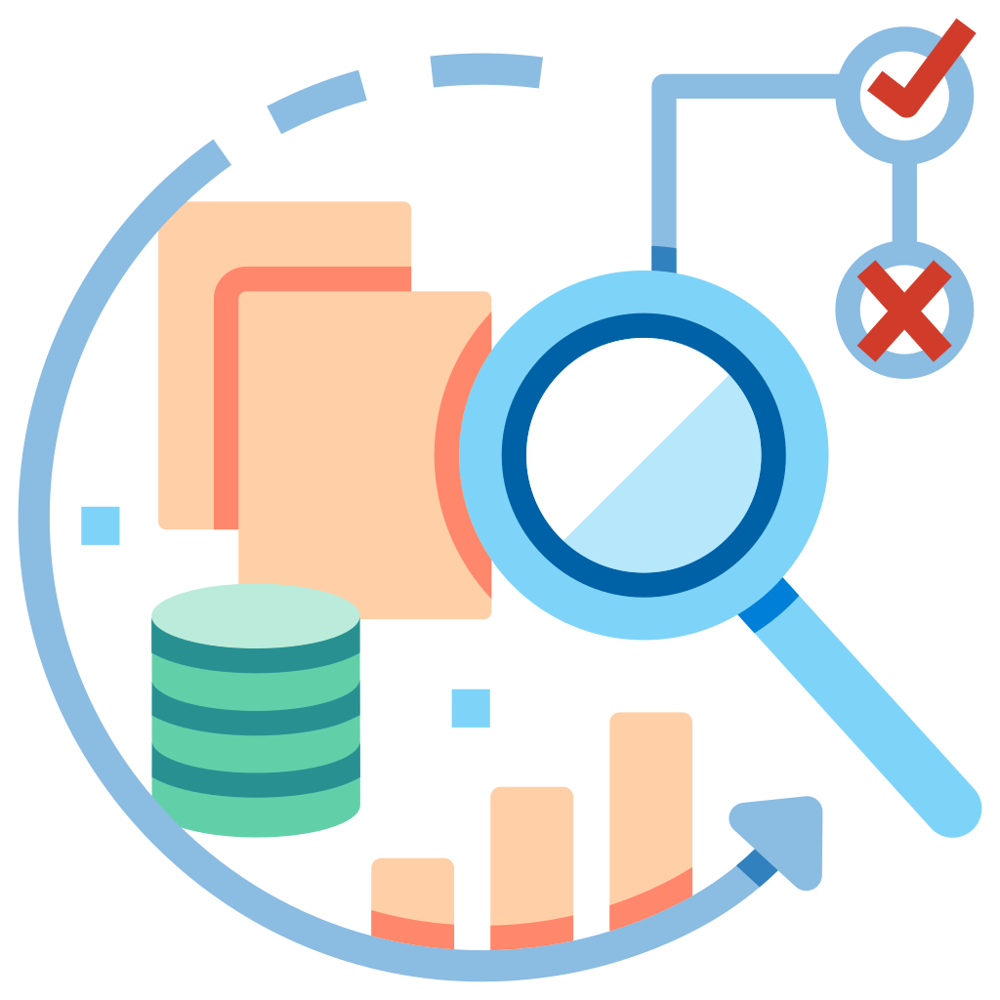
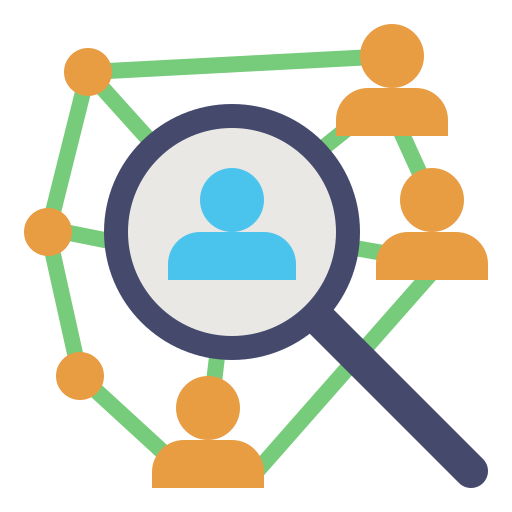

```{css, echo=FALSE}
.infobox {
  padding: 1em 1em 1em 4em;
  margin-bottom: 10px;
  border: 2px solid #4f9ed4;
  border-radius: 10px;
  background: ##a3cde5 5px center/3em no-repeat;
}
```

# Bienvenido a La Casa de Datos - Consultoría

------------------------------------------------------------------------

#### *Análisis estadístico, Ciencia de Datos y Aplicaciones de Aprendizaje automático.*

------------------------------------------------------------------------

## ¿Para qué podemos usar el Aprendizaje Automático?

El aprendizaje automático (Machine Learning) es una rama de la Inteligencia Artificial que está revolucionando el mundo académico.

El análisis de datos masivos con estructuras y patrones complejos, a través del Aprendizaje Automático, está acelerando la investigación científica, permitiendo a investigadores y académicos explorar nuevas fronteras, impulsando el descubrimiento y la innovación.

<center>{width="256"}</center>

<div>

::: {.infobox data-latex="warning"}
> 🚀️ Ahora podemos completar tareas de investigación que serían casi imposibles de abordar con métodos estadísticos convencionales.
:::

</div>

Para organizaciones sociales, el aprendizaje automático tiene también un gran potencial transformador; puede ayudarnos a predecir patrones de donación y personalizar estrategias de recaudación de fondos, identificar individuos o áreas de interés para la asignación estratégica de recursos, evaluar la opinión pública sobre proyectos y campañas, detectar anomalías, predecir fallos, etc.

<center>{width="256"}</center>

<div>

::: {.infobox data-latex="warning"}
> 📈 La capacidad de predecir resultados y segmentar poblaciones son recursos invaluables para las organizaciones.
:::

</div>

El aprendizaje automático nos permite extraer además información valiosa de investigaciones pasadas. Las bases de datos inactivas o archivadas, a menudo olvidadas, contienen un tesoro de información valiosa. El aprendizaje automático nos ofrece una anueva perspectiva para analizarlas. Los Algoritmos de clasificación, regresión y agrupamiento (“clustering”) pueden descubrir patrones ocultos, tendencias históricas y relaciones inesperadas que los métodos estadísticos tradicionales no revelan.

<center>{width="256"}</center>

<div>

::: {.infobox data-latex="warning"}
> 🪏 El aprendizaje automático nos permite transformar datos pasados, inactivos o archivados en conocimiento estratégico para el presente.
:::

</div>

------------------------------------------------------------------------

## Acerca de mi.

#### *La Casa de Datos es Erick García-García, Ph.D*

Soy un Científico de Datos, Profesor y Editor Científico.

Tengo más de 25 años de experiencia internacional en investigación, publicación académica y educación superior.

Soy Doctor en Ciencias Biomédicas por la Universidad Nacional Autónoma de México (UNAM). He desarrollado una sólida trayectoria como investigador postdoctoral en instituciones de prestigio en México, Canadá y España, incluyendo un contrato Marie Curie en la Universidad de Murcia.

Actualmente combino mi experiencia académica con el emprendimiento educativo, ejerciendo como Co-director de [Casa d’Estudis El Pont](https://www.casadestudiselpont.eu/), una academia privada que co-dirijo desde 2009, y como Director de [Casa de Lletres](https://www.casadelletres.eu/), empresa especializada en servicios de traducción y edición académica que fundé en 2017. Aplico además toda mi pasión por la enseñanza como profesor de Matemáticas e Informática para Home Schoolers en [La Escuela de Verdad](https://laescueladeverdad.org).

En enero de 2026 obtuve la certificación profesional como Científico de Datos por la Universidad de Harvard (a través de HarvardEx) y decidí fundar La Casa de Datos - Consultoría, para brindar apoyo a académicos, empresas y asociaciones en análisis de datos (análisis estadístico y visualización) y aplicaciones de aprendizaje automático (Machine Learning) para resolver problemas de datos complejos.

Mi trayectoria docente abarca universidades en tres países, donde he impartido clases de biología celular, transducción de señales y redacción científica; además he tutelado estudiantes de maestría. Entre mis reconocimientos destacan la membresía en el Sistema Nacional de Investigadores de México (Nivel I) y la triple certificación de la Agencia Nacional Española de Evaluación de la Calidad Académica (ANECA) como profesor universitario.

Me gusta el cine, la música, la pintura y la fotografía.

<center>{width="256"}</center>
