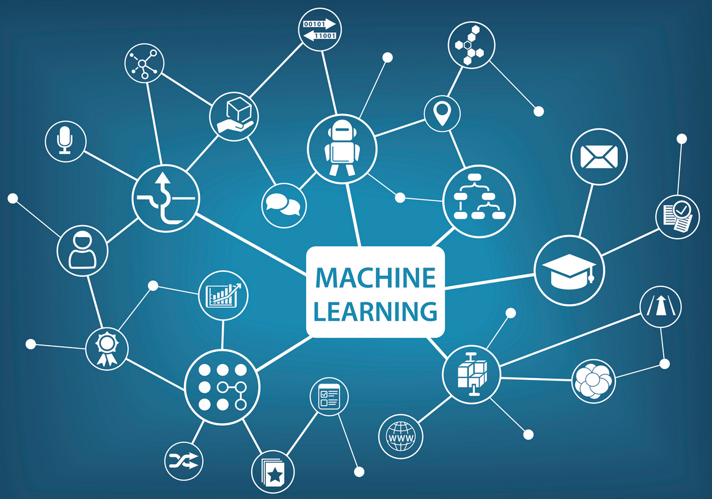

```{r setup, include=FALSE}
knitr::opts_chunk$set(echo = FALSE)
```

```{css, echo=FALSE}
CSS sections

{css, echo=FALSE}
.infobox {
  padding: 1em 1em 1em 1em;
  margin-bottom: 1px;
  border: 2px solid #4f9ed4;
  border-radius: 10px;
  background: ##a3cde5 5px center/3em no-repeat;
}

.fig_legend {
  font-size: 0.8rem;
  line-height: 1.2;
}
```

# El Aprendizaje Automático: un nuevo paradigma para la resolución de problemas complejos

El aprendizaje automático (*Machine Learning*) ha emergido como uno de los campos más transformadores dentro de la ciencia computacional contemporánea, siendo la base del desarrollo de la inteligencia artificial.

El aprendizaje automático es una intersección entre la estadística, la teoría de la computación y la optimización matemática. Esta nueva disciplina ha redefinido los límites metodológicos de la investigación interdisciplinaria y la resolución de problemas complejos y representa un cambio paradigmático en cómo abordamos el análisis de fenómenos que desafían los métodos analíticos tradicionales.

IMG

El aprendizaje automático se distingue de la programación algorítmica convencional por su capacidad de inferir patrones en estructuras de datos a partir de observaciones empíricas, sin requerir especificaciones explícitas sobre el total de las reglas heurísticas que componen un algoritmo convencional. Este enfoque inductivo contrasta con los métodos deductivos tradicionales, permitiendo la construcción de modelos predictivos y descriptivos en áreas del conocimiento, de la invesitagación y del desarrollo que se caracterizan por una alta dimensionalidad (cientos o miles de variables), ausencia de linealidad, y la existencia de relaciones causales o correlaciones complejas.

{width="700"}
