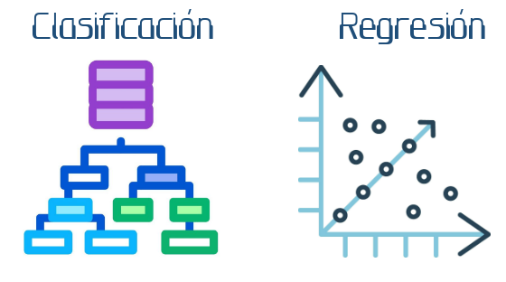
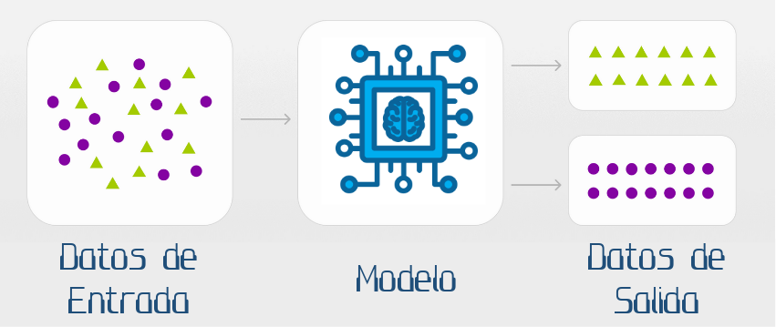
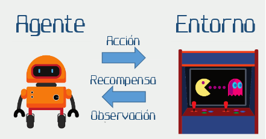

```{r setup, include=FALSE}
knitr::opts_chunk$set(echo = FALSE)
```

```{css, echo=FALSE}
CSS sections

{css, echo=FALSE}
.infobox {
  padding: 1em 1em 1em 1em;
  margin-bottom: 1px;
  border: 2px solid #4f9ed4;
  border-radius: 10px;
  background: ##a3cde5 5px center/3em no-repeat;
}

.fig_legend {
  font-size: 0.8rem;
  line-height: 1.2;
}
```

# El Aprendizaje Automático: un nuevo paradigma para la resolución de problemas complejos

El aprendizaje automático (*Machine Learning*) ha emergido como uno de los campos más transformadores dentro de la ciencia computacional contemporánea, siendo la base del desarrollo de la inteligencia artificial.

El aprendizaje automático es una intersección entre la estadística, la teoría de la computación y la optimización matemática. Esta nueva disciplina ha redefinido los límites metodológicos de la investigación interdisciplinaria y la resolución de problemas complejos y representa un cambio paradigmático sobre cómo abordamos el análisis de fenómenos que desafían los métodos analíticos tradicionales.

<div>

<center></center>

</div>

El aprendizaje automático se distingue de la programación algorítmica convencional por su capacidad de inferir patrones en estructuras de datos a partir de observaciones empíricas, sin requerir especificaciones explícitas sobre el total de las reglas heurísticas que componen un algoritmo convencional. Este enfoque inductivo contrasta con los métodos deductivos tradicionales, permitiendo la construcción de modelos predictivos y descriptivos en áreas del conocimiento, de la investigación y del desarrollo que se caracterizan por una alta dimensionalidad (cientos o miles de variables), la presencia de relaciones no lineales entre variables, y la existencia de relaciones causales y/o correlaciones complejas.

{width="700"}

### Clasificación de tareas del Aprendizaje Automático

Existen tres grandes campos dentro de la disciplina del Aprendizaje Automático:

El **aprendizaje supervisado** se basa en la existencia de datos etiquetados; es decir datos en los que existe una variable de respuesta cuyo valor es conocido. El objetivo de las tareas de aprendizaje supervisado es aprender una función de mapeo entre las variables independientes y la variable de respuesta. Técnicas como la regresión, máquinas de vectores de soporte y redes neuronales profundas son altamente eficaces en tareas de clasificación y predicción.

<div>

<center>{width="600"}</center>

</div>

```         
```

::: {.infobox data-latex=""}
> 🔮 El **aprendizaje supervisado** nos permite predecir una variable de respuesta nominal o numérica a partir de una función de mapeo "entrenada" con datos existentes.
>
> 🔬 Detección de fraude, predicción de precios, tareas de diagnóstico, análisis de calidad, detección de anomalías, análisis de opinión, recomendación y segmentación con base en rasgos conocidos, son algunas de las aplicaciones del aprendizaje supervisado.
:::

```         
```

El **aprendizaje no supervisado** analiza las estructuras latentes en datos sin etiquetas ni ejemplos previos; es decir, datos en los que no necesariamente existe una variable de respuesta. El objetivo del aprendizaje no supervisado es es encontrar patrones, agrupaciones o estructuras ocultas en los datos, facilitando la exploración y la comprensión de grandes conjuntos de información. En esta área, técnicas de reducción de dimensionalidad (integración matemática de múltiples variables en una única medida artificial) y múltiples algoritmos de agrupación nos ayudan a entender las relaciones ocultas entre variables (ver como ejemplo el *post "[Decisiones difíciles](https://lacasadedatos.github.io/blog/blog_posts/2026-01-05-decisiones-difciles/)"*)

<div>

<center>{width="700"}</center>

</div>

```         
```

::: {.infobox data-latex=""}
> 🔎 Descubrir los patrones ocultos en los datos, es decir las relaciones ocultas entre las variables, a través del **aprendizaje no supervisado**, nos permite crear agrupaciones de casos similares y comenzar a comprender qué caracteriza a cada grupo.
:::

```         
```

Finalmente, el **aprendizaje por refuerzo** es una rama del aprendizaje automático donde un *agente* (un algoritmo complejo) aprende a tomar decisiones en dentro de un entorno para maximizar una recompensa. A través de prueba y error, el agente aprende qué acciones conducen a resultados deseables, adaptando su comportamiento para optimizar el rendimiento. El aprendizaje por refuerzo es la base de la creación de sistemas inteligentes capaces de aprender y adaptarse a entornos complejos.

<div>

<center>{width="600"}</center>

</div>

<div>

</div>

```         
```

::: {.infobox data-latex=""}
> 🤖 El **aprendizaje por refuerzo** es la base de sistemas de control autónomos y agentes de Inteligencia Artificial.
:::

```         
```

Como hemos podido ver, el **aprendizaje automático** revoluciona nuestra forma de abordar problemas complejos a través de la fisión de las matemáticas, la estadística y la programación. A través de la inferencia de patrones existentes en grandes volúmenes de datos, las tareas de predicción y clasificación nos abren las puertas para resolver grandes problemas con soluciones innovadoras y efectivas.

# ¿Podemos ayudarte usando Aprendizaje Automático?

Si recopilas o almacenas datos e intuyes que puedes sacarles provecho pero no sabes cómo, ponte en [contacto](erick.garcia@casadelletres.eu) con nosotros. Seguramente podemos diseñar algo a medida para ti: diseñar nuevas estrategias, crear nuevas publicaciones, mejorar tus procedimientos, analizar tus datos históricos con una nuevo óptica, etc.

Te invitamos a visitar nuestra sección de [Aplicaciones](https://lacasadedatos.github.io/blog/aplications_of_ML.html) para encontrar inspiración.
